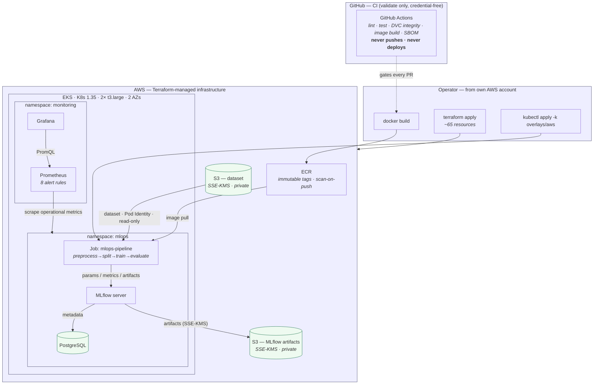

# MLOps Platform on AWS EKS

[](https://github.com/asadhanif3188/mlops-platform-on-eks/actions/workflows/ci.yml)

A cloud-native **MLOps platform-engineering case study**: a reproducible ML
pipeline wrapped in a Terraform-provisioned AWS EKS platform with secure workload
identity, cloud-backed data, an in-cluster MLflow tracking stack, Prometheus/Grafana
observability, controlled failure-and-recovery testing, and container supply-chain
controls.

**Strongest proof:** the full platform was provisioned on **real Amazon EKS**, three
critical failures were **injected and recovered** under runbook guidance, every
mandatory alert **fired and resolved**, and the environment was **destroyed and
verified clean** — captured live on 2026-08-22.
[Sprint 8 Release Gate → PASS](docs/proof/sprint-08-release-gate.md) ·
[Live-EKS validation evidence](docs/proof/sprint-08-pr16-release-validation-evidence.md) ·
[Architecture](docs/architecture.md)

> This is a **portfolio-scoped platform-engineering proof**, not a production
> service. It does not claim enterprise SRE, 24/7 operations, SLAs, multi-region
> DR, or model serving at scale — see [Known Limitations](#14--known-limitations).

---

## 1 · What this is

A single repository that takes a small, honest ML workload — a Random Forest
classifier on the Pima Indians Diabetes dataset — and builds the **cloud-native
platform around it** that turns "a training script" into an operable system:
infrastructure as code, secure identity, observability, failure handling, and
supply-chain traceability, all proven on live AWS.

The interesting engineering is **the platform, not the model**.

## 2 · The problem it solves

The repository began as a course-style, local MLOps pipeline (DVC + MLflow on a
laptop). That proves reproducibility, but it proves nothing about **operating**
ML on cloud infrastructure. This project progressively re-engineered that starting
point into a platform that answers the questions a reviewer actually cares about:

- How is the infrastructure provisioned, and can it be torn down cleanly? → **Terraform / EKS**
- How does the workload get credentials without static keys? → **EKS Pod Identity**
- Where does data and experiment state live? → **KMS-encrypted S3 + in-cluster MLflow/PostgreSQL**
- How do you know it's healthy — and how do you know when it isn't? → **Prometheus / Grafana / alerts**
- What happens when something breaks, and how is it recovered? → **injected failures + proven runbooks**
- Can you trace what's actually running back to a git commit? → **SBOM + immutable digest provenance**

The ML model is deliberately simple so the platform engineering is the subject.

## 3 · What I engineered

Concrete ownership in this repository:

- **Repository & quality gates** — Ruff, mypy (strict), pytest (233 passing), pre-commit, CI ([CI/CD](docs/ci-cd.md))
- **Container architecture** — multi-stage, non-root [`Dockerfile`](Dockerfile); build/dev/runtime targets ([ADR-005](docs/decisions/ADR-005-containerization-strategy.md))
- **Kubernetes runtime** — finite-run `batch/v1` **Job** (not a Deployment), Kustomize base + overlays ([`k8s/`](k8s/), [ADR-009](docs/decisions/ADR-009-kubernetes-workload-model.md))
- **Terraform AWS/EKS foundation** — VPC, least-privilege IAM, managed EKS, ECR ([`terraform/`](terraform/), [ADR-014](docs/decisions/ADR-014-terraform-architecture.md))
- **Workload identity** — EKS Pod Identity, no static AWS credentials ([ADR-024](docs/decisions/ADR-024-vpc-cni-pod-identity.md))
- **Cloud-backed data** — S3 dataset retrieval at runtime with checksum verification ([ADR-027](docs/decisions/ADR-027-s3-dataset-runtime-retrieval.md))
- **In-cluster MLflow platform** — self-hosted server + PostgreSQL metadata + S3 artifacts ([ADR-026](docs/decisions/ADR-026-in-cluster-mlflow-platform.md), [MLflow Platform](docs/mlflow-platform.md))
- **Kubernetes security** — non-root, PSA restricted, seccomp, dropped capabilities ([Kubernetes Security](docs/kubernetes-security.md), [ADR-010](docs/decisions/ADR-010-kubernetes-security-hardening.md))
- **Observability** — Prometheus + Grafana across four signal layers ([Observability](docs/observability.md), [ADR-028](docs/decisions/ADR-028-observability-architecture.md))
- **Alerting** — eight unit-tested alert rules keyed to operator actions ([Alerting](docs/alerting.md), [ADR-033](docs/decisions/ADR-033-alerting.md))
- **NetworkPolicy** — deny-by-default east-west isolation ([Network Policies](docs/network-policies.md), [ADR-034](docs/decisions/ADR-034-network-policies.md))
- **Failure injection & runbooks** — dataset / MLflow / OOM scenarios + proven recovery ([Runbooks](docs/runbooks/README.md))
- **Supply-chain controls** — CycloneDX SBOM + immutable ECR digest provenance ([Supply-Chain Provenance](docs/supply-chain-provenance.md), [ADR-036](docs/decisions/ADR-036-sbom-and-image-provenance.md))

The underlying ML pipeline concept (train/evaluate a classifier) comes from a
course template; the platform, cloud, security, observability, and reliability
engineering above is the work this repository demonstrates.



<sub>Full architecture-visuals package (security, observability, failure/recovery,
supply-chain, evolution): [docs/diagrams/](docs/diagrams/).</sub>

## 4 · What ran for real

Captured on live Amazon EKS during the Sprint 8 release-candidate session
([full evidence](docs/proof/sprint-08-pr16-release-validation-evidence.md),
[batched live-EKS evidence](docs/proof/sprint-08-live-eks-evidence.md)):

- **Terraform provisioned** the environment — `Apply complete! Resources: 65 added`
- **EKS cluster ACTIVE**, `v1.35.6-eks`, **2 × t3.large nodes Ready** across 2 AZs
- **Dataset retrieved from S3** via Pod Identity (no static keys) with checksum verified
- **Pipeline Job Complete, exit 0** — all **5/5 stages** `success=1`
- **MLflow run persisted** — metadata in **PostgreSQL**, artifacts in **S3**; registered model
- **Prometheus: 11 scrape targets UP**; **3 Grafana dashboards** served live data
- **Controlled failures injected, detected, and recovered** (see §5)
- **Final healthy state restored** — 0 alerts firing, 16 runs persisted, `pg_up=1`
- **`terraform destroy`** symmetric (65 destroyed); **verified clean** three ways; nothing left billing

## 5 · Failure & recovery proof

Three mandatory failure scenarios were injected on live EKS. Each was detected by
the monitoring stack, fired its alert, was diagnosed and recovered via a repository
runbook **with no undocumented knowledge**, and resolved.

| Failure | Detection signal | Recovery | Evidence |
|---|---|---|---|
| **Dataset unavailable** (S3 object deleted → 404) | `mlops_pipeline_stage_success{stage="fetch_dataset"}=0`; `PipelineJobFailed` FIRING | Re-upload dataset (SSE-KMS); 5/5 stages `success=1` | [runbook](docs/runbooks/dataset-retrieval-failure.md) · [gate §4.B](docs/proof/sprint-08-release-gate.md) |
| **MLflow outage** (Deployment scaled to 0) | `probe_success=0` while `pg_up=1` (DB ruled out); `MLflowDown` FIRING | `kubectl scale --replicas=1`; probe recovers; prior runs preserved (6→6) | [runbook](docs/runbooks/mlflow-unavailable.md) · [gate §4.C](docs/proof/sprint-08-release-gate.md) |
| **OOMKilled** (memory limit cut to 128Mi) | `kube_pod_container_status_terminated_reason{reason="OOMKilled"}=1`, exit 137; `PipelineJobOOMKilled` FIRING | Restore 512Mi limit; pod Completes exit 0 | [runbook](docs/runbooks/oomkilled.md) · [gate §4.D](docs/proof/sprint-08-release-gate.md) |

The live sessions also surfaced **four real defects that only manifested under
enforcement/runtime** — e.g. an enforced NetworkPolicy blocking Pod Identity
credential retrieval, and an OOM alert that keyed on a KSM metric a
`restartPolicy: Never` Job can never populate. All were fixed and re-validated
([findings §3](docs/proof/sprint-08-live-eks-evidence.md#3-findings--4-real-defects-the-live-run-surfaced-all-fixed)).
Finding and fixing these is the point of testing failure on real infrastructure.

## 6 · Key engineering decisions

Each is recorded as an Architecture Decision Record:

| Decision | Choice | Rationale |
|---|---|---|
| Workload model | **Kubernetes Job**, not Deployment | Finite batch workload; no invented HTTP service ([ADR-009](docs/decisions/ADR-009-kubernetes-workload-model.md)) |
| Dataset delivery | **S3 runtime retrieval**, not baked/ConfigMap | Cloud-backed, checksum-verified, decoupled from the image ([ADR-027](docs/decisions/ADR-027-s3-dataset-runtime-retrieval.md)) |
| Cloud credentials | **EKS Pod Identity**, not static keys | No long-lived secrets in the cluster ([ADR-024](docs/decisions/ADR-024-vpc-cni-pod-identity.md)) |
| Experiment tracking | **In-cluster MLflow**, not external SaaS | Self-contained platform; PostgreSQL + S3 backends ([ADR-026](docs/decisions/ADR-026-in-cluster-mlflow-platform.md)) |
| Reliability approach | **Test failure before hardening** | Hardening driven by observed failures, not speculation ([ADR-037](docs/decisions/ADR-037-pipeline-reliability-hardening.md)) |
| Deliberately deferred | **GitOps & Terraform remote state** | Out of scope for a portfolio proof; documented, not hidden ([Roadmap](docs/roadmap.md), [ADR-014](docs/decisions/ADR-014-terraform-architecture.md)) |

Full index: [docs/decisions/](docs/decisions/README.md) (ADR-001 … ADR-037).

## 7 · Security posture

- **Non-root** containers, fixed UID/GID `10001`; `allowPrivilegeEscalation: false`
- **Pod Security Admission: restricted**; **seccomp** `RuntimeDefault`; **all Linux capabilities dropped**
- **No static AWS credentials** — EKS Pod Identity for S3 access
- **KMS encryption** — SSE-KMS on the S3 dataset/artifact buckets and EKS Secrets
- **EKS access entries** (API auth mode; no `aws-auth` configmap), least-privilege IAM
- **NetworkPolicy** deny-by-default with explicit allow (9 functional tests: 6 allowed, 3 denied)
- **ServiceAccount** token automount off — the workload needs no cluster API access

Detail: [SECURITY.md](SECURITY.md) · [Kubernetes Security](docs/kubernetes-security.md) · [Network Policies](docs/network-policies.md)

## 8 · Observability & reliability

- **Prometheus** across four layers — Kubernetes platform, ephemeral pipeline Job, MLflow server, PostgreSQL (11 targets UP on the live run)
- **Grafana** — 3 dashboards (EKS Platform Health, Pipeline Operations, MLflow Platform Health), proven serving live data
- **Pipeline operational metrics** — per-stage `success` / `duration` pushed to the Prometheus Pushgateway
- **MLflow / PostgreSQL monitoring** — blackbox HTTP probe + postgres-exporter (`probe_success`, `pg_up`)
- **Eight actionable alerts**, each keyed to an operator action and unit-tested (`promtool test rules`)
- **Runbooks** for every critical path, [exercised against live failures](docs/proof/sprint-08-release-gate.md#5-runbook-validation-matrix)

Detail: [Observability](docs/observability.md) · [Alerting](docs/alerting.md) · [Monitoring Operations](docs/monitoring-operations.md)

## 9 · Evidence index

Where to verify each headline claim. For the complete map — every capability,
its proof, and how strong that proof is — see the **[Evidence Index](docs/proof/README.md)**.

| Claim | Canonical evidence |
|---|---|
| Platform ran healthy on real EKS | [Release gate §4.A](docs/proof/sprint-08-release-gate.md) · [PR 16 evidence](docs/proof/sprint-08-pr16-release-validation-evidence.md) |
| Failures injected, detected, recovered | [Release gate §4.B–4.D](docs/proof/sprint-08-release-gate.md) · [Runbook matrix §5](docs/proof/sprint-08-release-gate.md#5-runbook-validation-matrix) |
| All mandatory alerts fired & resolved | [Live-EKS evidence §6–7](docs/proof/sprint-08-live-eks-evidence.md) |
| NetworkPolicy enforced (6 allow / 3 deny) | [Network policy evidence](docs/proof/sprint-08-network-policy-runtime-evidence.md) |
| Supply chain: git → digest → running pod | [SBOM/provenance evidence](docs/proof/sprint-08-sbom-provenance-evidence.md) · [Release gate §9](docs/proof/sprint-08-release-gate.md) |
| Infrastructure destroyed & verified clean | [Live-EKS evidence §8](docs/proof/sprint-08-live-eks-evidence.md#8-teardown) |
| Dashboards / alerts (visual) | [`docs/screenshots/`](docs/screenshots/) |

Release verdict: **[Sprint 8 Release Gate — PASS](docs/proof/sprint-08-release-gate.md)** (23/23 proof dimensions).

## 10 · Technology stack

| Layer | Technologies |
|---|---|
| Language & ML | Python 3.12, scikit-learn, pandas |
| Reproducibility & tracking | DVC, MLflow, PostgreSQL, S3 |
| Container & packaging | Docker (multi-stage), CycloneDX SBOM, Trivy |
| Orchestration | Kubernetes (EKS), Kustomize |
| Infrastructure as code | Terraform (VPC, IAM, EKS, ECR, KMS, S3) |
| Identity | EKS Pod Identity |
| Observability | Prometheus, Grafana, Pushgateway, blackbox/postgres exporters |
| CI & quality | GitHub Actions, Ruff, mypy, pytest, pre-commit |

## 11 · Repository structure

```
src/         ML pipeline stages (preprocess, split, train, evaluate)
k8s/         Kustomize manifests: base + overlays (local, aws), monitoring, netpol
terraform/   AWS foundation — VPC, IAM, EKS, ECR, KMS, S3
docs/        Architecture, ADRs, runbooks, proof/evidence, operations guides
tests/       smoke / unit / integration / contract suites
scripts/     build, digest-verify, cloud render/apply helpers
Dockerfile   multi-stage (builder / development / runtime)
dvc.yaml     pipeline graph; params.yaml — hyperparameters
```

Start here: [docs/README.md](docs/README.md) (documentation index) ·
[docs/architecture.md](docs/architecture.md) · [docs/project-structure.md](docs/project-structure.md)

## 12 · Reproduce / validate

```bash
# Static quality gates (what CI runs)
make check                     # ruff + mypy + pytest

# Run the pipeline in a container (mount state, no credentials needed)
docker build -t ml-pipeline:local .
docker run --rm --env-file .env \
  -v "$(pwd)/data":/app/data -v "$(pwd)/models":/app/models ml-pipeline:local

# Render the Kubernetes manifests
kustomize build k8s/overlays/local

# Provision the cloud platform (operator's own AWS account; tears down cleanly)
#   see docs/cloud-operations.md for the full provision → prove → destroy runbook
```

Depth: [Containerization](docs/containerization.md) · [Docker Development](docs/docker-development.md) ·
[Kubernetes README](k8s/README.md) · [Cloud Operations](docs/cloud-operations.md) · [CI/CD](docs/ci-cd.md)

## 13 · The ML pipeline (in brief)

A DVC-orchestrated graph — `preprocess → split → train → evaluate` — trains a
`RandomForestClassifier` on the Pima Indians Diabetes dataset and reports a genuine
**out-of-sample** accuracy on a disjoint held-out split. Stage ownership, the
evaluation boundary, and reproducibility guarantees are specified in the
[Pipeline Contract](docs/pipeline-contract.md) and enforced by the `contract` test
suite. The model is intentionally simple; it exists to give the platform something
real to run.

## 14 · Known limitations

This project **does not** claim, and its evidence does not support:

- Enterprise SRE, formal SLA/SLO, or 24/7 on-call operations
- Multi-region high availability or disaster recovery
- Model serving / online inference at scale
- GitOps or Terraform remote state (intentionally deferred)
- Service mesh or distributed tracing
- A fully signed/attested supply chain (SBOM + digest yes; cosign/SLSA deferred)
- Enterprise centralized logging beyond structured application logs

The validation cluster was **short-lived, single-operator, and 2 nodes** —
sufficient to prove the operational model, not production scale. Limitations are
tracked openly in the [Roadmap](docs/roadmap.md) and each sprint's release gate.

## 15 · Deeper reading

- **[Evidence Index](docs/proof/README.md)** — every claim mapped to its canonical proof and proof strength
- **[Architecture](docs/architecture.md)** — system design, components, data flow
- **[Sprint 8 Release Gate](docs/proof/sprint-08-release-gate.md)** — the PASS audit, 23 proof dimensions
- **[Live-EKS Validation Evidence](docs/proof/sprint-08-pr16-release-validation-evidence.md)** — the authoritative runtime record
- **[Architecture Decision Records](docs/decisions/README.md)** — ADR-001 … ADR-037
- **[Operational Runbooks](docs/runbooks/README.md)** · **[Cloud Operations](docs/cloud-operations.md)**
- **[Roadmap](docs/roadmap.md)** · **[Engineering Philosophy](docs/philosophy.md)** · **[CHANGELOG](CHANGELOG.md)**

---

<sub>MIT-licensed portfolio project. Experiment tracking runs on the in-cluster MLflow
platform; DagsHub is used as a DVC **data** remote only ([ADR-026](docs/decisions/ADR-026-in-cluster-mlflow-platform.md)).</sub>
