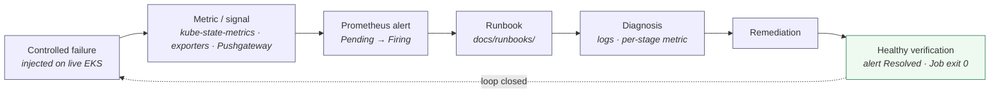

# Failure / Recovery Loop

**Title.** Failure / Recovery Loop — from a controlled failure to verified health.

**Purpose.** Show the closed operational loop this platform was built to support:
inject a controlled failure, catch it on a real signal, fire an alert, follow a
runbook, remediate, and **verify** the return to health — with three real examples
exercised on live EKS.

Design of record: [observability.md](../../observability.md),
[alerting.md](../../alerting.md), [runbooks/](../../runbooks/README.md);
[ADR-028](../../decisions/ADR-028-observability-architecture.md),
[ADR-033](../../decisions/ADR-033-alerting.md).

> **Status.** ✅ The loop was run for real: the Sprint 8 failure-injection campaign
> drove each scenario on live EKS and captured the alert firing and the verified
> recovery ([Sprint 8 evidence](../../proof/README.md)).

## The loop



## Real examples (annotations)

| Injected failure | Signal | Alert | Runbook | Remediation → verification |
|---|---|---|---|---|
| **Dataset unavailable / integrity mismatch** | `mlops_pipeline_stage_success{stage="fetch_dataset"}=0` (Pushgateway) pinpoints the stage; the Job's terminal `kube_job_failed{condition="true"}` fires the alert | `PipelineJobFailed` | [dataset-retrieval](../../runbooks/dataset-retrieval-failure.md) · [dataset-integrity](../../runbooks/dataset-integrity-failure.md) | Restore bytes / update pinned `DATASET_SHA256` deliberately → re-run green. A checksum mismatch fails fast **by design** (no retry). |
| **MLflow outage** | `probe_success=0` (blackbox `/health`) | `MLflowDown` (+ `PipelineJobFailed`) | [mlflow-unavailable](../../runbooks/mlflow-unavailable.md) | Scale `deploy/mlflow` back up → re-drive the run. Experiment history is **not lost** (it lives in PostgreSQL). |
| **OOMKilled pipeline pod** | `kube_pod_container_status_terminated_reason=OOMKilled` (KSM) | `PipelineJobOOMKilled` | [oomkilled](../../runbooks/oomkilled.md) | Reduce working set **or** restore the measured 512Mi limit → pod returns to exit 0. |

**What it proves / helps explain.**

- Reliability here is a **verified loop**, not a claim: every alert keys to a
  persistent signal that survives the batch pod's exit (via the kube-state-metrics
  Job/Pod objects), maps to a concrete runbook, and ends in an explicit
  *recovery-verified* step.
- The examples are **real induced faults**, chosen because the evidence supports
  them — not hypothetical failure modes.

**Limitations.** Alerts evaluate on Prometheus's own `/alerts`; there is **no**
Alertmanager routing to email/Slack/PagerDuty (deliberately deferred,
[alerting.md § Known limitations](../../alerting.md#known-limitations)). Recovery is
operator-driven; there is **no** auto-remediation and **no** HA/DR.

## ASCII fallback

```text
Controlled failure ─▶ metric/signal ─▶ alert (Pending→Firing) ─▶ runbook
        ▲                                                           │
        └────── loop closed ◀── healthy verification ◀── remediation ◀── diagnosis
Examples:  dataset fail → PipelineJobFailed    MLflow down → MLflowDown    OOM → PipelineJobOOMKilled
```
