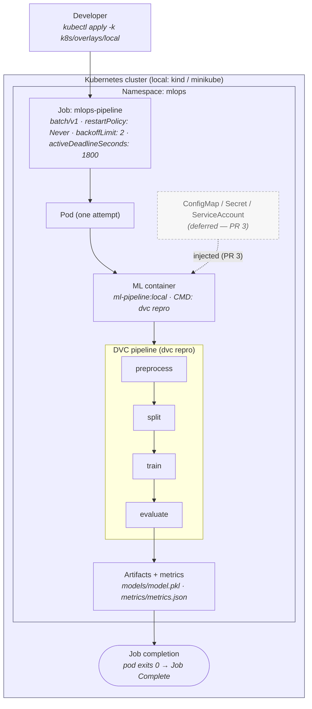

# Kubernetes Architecture Diagram

Source for the Kubernetes batch-workload architecture. Rendered and discussed in
[docs/kubernetes-architecture.md](../../kubernetes-architecture.md); the design of
record is [ADR-009](../../decisions/ADR-009-kubernetes-workload-model.md).

> **Status.** Reflects Sprint 5 through PR 2: the `mlops` namespace and the
> **runnable** `batch/v1` Job (real image + `dvc repro` + finite-run lifecycle).
> Objects marked *(deferred)* are design contracts implemented in later PRs
> (config/secrets, security, resources).

## Workload flow



## ASCII fallback

```text
Developer ── kubectl apply ─▶ Kubernetes cluster
                                    │
                             Namespace: mlops
                                    │
                              Job: mlops-pipeline
                                    │
                                   Pod
                                    │
                              ML container (dvc repro)
                                    │
              preprocess ─▶ split ─▶ train ─▶ evaluate
                                                  │
                                     artifacts / metrics
                                                  │
                                          Job completion (exit 0)
```
