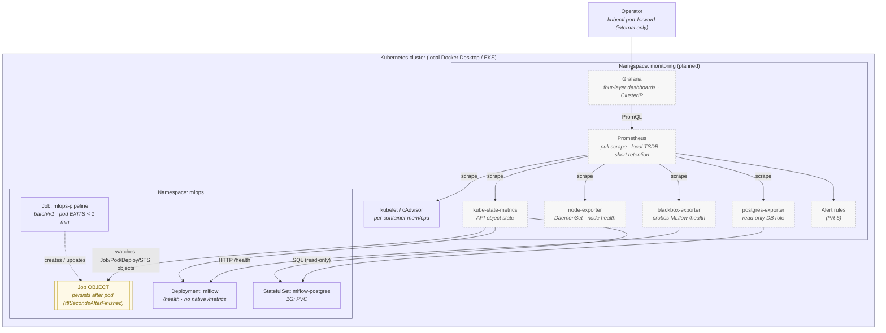
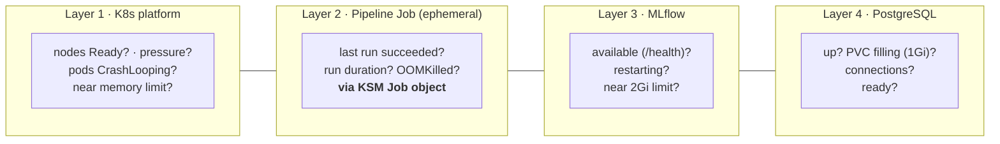

# Observability Architecture Diagram

Source for the Sprint 8 observability architecture. Discussed in
[docs/observability.md](../../observability.md); the design of record is
[ADR-028](../../decisions/ADR-028-observability-architecture.md).

> **Status.** 🎯 **Target architecture — nothing here is deployed yet.** This is
> the picture the Sprint 8 runtime PRs (2–6) build toward; PR 1 defines it. Every
> monitoring component below is *planned*, not present in the repository at the
> time of writing. The one edge that solves the ephemeral-Job problem — **KSM
> reads the persistent `Job` object, not the exited pod** — is drawn deliberately.

## Target architecture



## The four layers (what Prometheus/Grafana surface)



## ASCII fallback

```text
Operator ── kubectl port-forward (internal only) ─▶ Grafana ──PromQL──▶ Prometheus
                                                                            │ pull scrape
        ┌───────────────────────────────────────────────────────────────┬─┴───────────────┐
        ▼                    ▼                 ▼                ▼          ▼                 ▼
  kube-state-metrics   node-exporter     kubelet/cAdvisor  blackbox-exp  postgres-exp   (alert rules)
        │                                                     │             │
        │ watches API OBJECTS                        HTTP /health      SQL (read-only)
        ▼                                                     ▼             ▼
  ┌───────────────┐                                       MLflow        PostgreSQL
  │  Job OBJECT   │◀── created by ── Job pod (EXITS <1min)  (Deployment)  (StatefulSet, 1Gi PVC)
  │ persists via  │
  │ ttlSeconds... │   ← the pod is gone, but its Job object (success/duration/OOM) is still scrapable
  └───────────────┘

Layers surfaced:  1) K8s platform   2) Pipeline Job (ephemeral, via KSM)   3) MLflow   4) PostgreSQL
```

## Why the highlighted edge matters

The pipeline **pod exits in under a minute** and has no Service to scrape
(ADR-009/011). The dashed **Job OBJECT** node is the key: **kube-state-metrics
watches the persistent `Job` API object, not the ephemeral process**, so
`succeeded / failed / start_time / completion_time` remain scrapable after the pod
is gone. The one Pod-object signal, **OOMKilled**
(`kube_pod_container_status_last_terminated_reason`), stays scrapable too because the
Job's finished pod is retained by owner-reference for as long as the Job — all
provided the finished Job (and its pod) outlives one scrape
(`ttlSecondsAfterFinished`). Full reasoning and the rejected alternatives
(Pushgateway, custom exporter, keep-alive sidecar) are in
[docs/observability.md § 4](../../observability.md#4-the-batch-job-problem-keeping-an-ephemeral-jobs-metrics-queryable)
and [ADR-028 § 3](../../decisions/ADR-028-observability-architecture.md#3-batch-workload-metric-strategy--kube-state-metrics-is-the-answer-not-pushgateway).
