# Platform Evolution

**Title.** Platform Evolution — from a course-style local pipeline to a cloud-native,
observable platform.

**Purpose.** Give a reviewer the one-line story of *how the repository grew*, mapped
to real versioned releases — so the transformation reads as deliberate engineering,
not a rewrite.

Design of record: [case-study.md § 6](../../case-study.md),
[CHANGELOG.md](../../../CHANGELOG.md), [roadmap.md](../../roadmap.md).

> **Status.** ✅ Each stage is a shipped, tagged release (v1.0.0 → v1.7.0). The
> "starting point" is the honestly-stated origin, not a release.

## Diagram

```mermaid
flowchart LR
    v0["Course-style<br/>local pipeline<br/><i>starting point</i>"]
    v1["Professional repo<br/><i>v1.0–1.1 · Sprints 1–2</i>"]
    v2["Container + CI<br/><i>v1.2 · Sprint 3</i>"]
    v3["Reproducible pipeline<br/><i>v1.3 · Sprint 4</i>"]
    v4["Kubernetes<br/><i>v1.4 · Sprint 5</i>"]
    v5["Terraform + EKS<br/><i>v1.5 · Sprint 6</i>"]
    v6["Cloud-native MLOps<br/><i>v1.6 · Sprint 7</i>"]
    v7["Observability &amp; reliability<br/><i>v1.7 · Sprint 8</i>"]

    v0 --> v1 --> v2 --> v3 --> v4 --> v5 --> v6 --> v7

    classDef origin fill:#f7f7f7,stroke:#aaa,stroke-dasharray:4 3,color:#555;
    classDef ship fill:#eef,stroke:#557,stroke-width:1px;
    class v0 origin;
    class v1,v2,v3,v4,v5,v6,v7 ship;
```



**What it proves / helps explain.**

- The platform was **grown in versioned increments**, each a discrete engineering
  theme with its own release — reproducibility before cloud, cloud before hardening,
  hardening before observability.
- The ML model itself barely changed; the **platform around it** is the work.

**Limitations.** This is a narrative timeline, not an architecture diagram — it
shows *sequence*, not components. The frontier stops at v1.7.0; everything past it
(GitOps, remote state, model serving, HA/DR, tracing) is roadmap, not history.

## ASCII fallback

```text
[course-style local pipeline]
   → professional repo (v1.0–1.1) → container + CI (v1.2) → reproducible pipeline (v1.3)
   → Kubernetes (v1.4) → Terraform + EKS (v1.5) → cloud-native MLOps (v1.6)
   → observability & reliability (v1.7)
```
