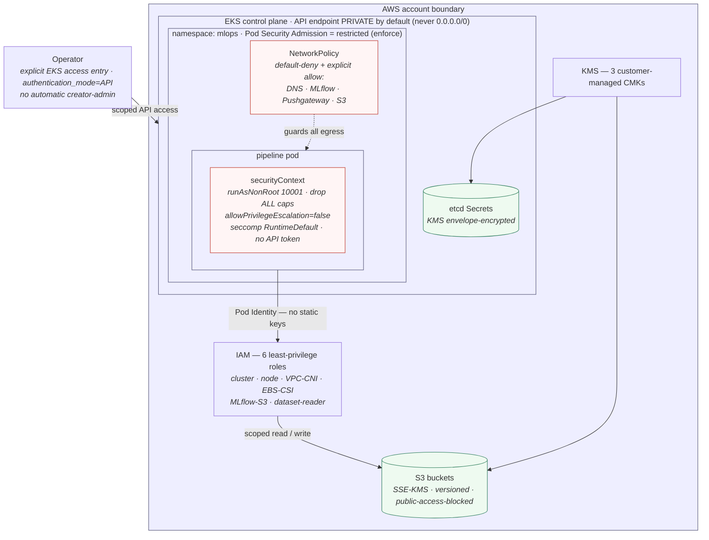

# Security Architecture

**Title.** Security Architecture — trust boundaries from the AWS account to the
container syscall surface.

**Purpose.** Show the nested security boundaries a reviewer should check: who can
reach the EKS API, how the workload gets AWS access, what encrypts data at rest, and
what constrains the pod at runtime — in one legible picture.

Design of record: [kubernetes-security.md](../../kubernetes-security.md),
[network-policies.md](../../network-policies.md), [SECURITY.md](../../../SECURITY.md);
ADRs [022](../../decisions/ADR-022-eks-secure-api-access.md),
[023](../../decisions/ADR-023-eks-access-control.md),
[024](../../decisions/ADR-024-vpc-cni-pod-identity.md),
[025](../../decisions/ADR-025-eks-secrets-kms-encryption.md),
[010](../../decisions/ADR-010-kubernetes-security-hardening.md),
[034](../../decisions/ADR-034-network-policies.md).

> **Status.** ✅ Every boundary below is implemented in `terraform/` and `k8s/` and
> was exercised on live EKS (Sprint 7–8). Each control is layered — defence in
> depth, not a single gate.

## Diagram



**What it proves / helps explain.**

- **API reachability** is closed by default: private endpoint, no `0.0.0.0/0`, and
  access granted only through explicit EKS access entries — not automatic
  creator-admin.
- **Workload identity is keyless**: the pod assumes an IAM role via **EKS Pod
  Identity**; no long-lived AWS credentials live in the cluster.
- **Encryption at rest** spans both etcd Secrets (KMS envelope) and every S3 bucket
  (SSE-KMS, public access blocked).
- **Runtime confinement** is enforced two ways — the namespace's **restricted Pod
  Security Admission** rejects a violating pod at admission, and the pod's own
  `securityContext` (non-root, dropped caps, no privilege escalation, seccomp) plus
  a **deny-by-default NetworkPolicy** constrain what a running container can do and
  reach.

**Limitations.** NetworkPolicy enforcement depends on the VPC CNI
(`enableNetworkPolicy=true`); the local Docker Desktop CNI admits but does not
enforce it. AWS S3 egress cannot be expressed as a precise pod-selector rule (real
S3 sits at dynamic public IPs), so that one path is allow-listed by the overlay, not
IP-pinned — documented in [ADR-034](../../decisions/ADR-034-network-policies.md).

## ASCII fallback

```text
Operator ──(explicit access entry, authn=API)──▶ EKS API (PRIVATE by default)
AWS account boundary
 ├─ IAM (6 least-privilege roles) ◀── Pod Identity (no static keys) ── pipeline pod
 │        └─ scoped read/write ─▶ S3 (SSE-KMS, public access blocked)
 ├─ KMS (3 CMKs) ─▶ etcd Secrets (envelope) + S3 (SSE-KMS)
 └─ EKS ▸ ns mlops (PSA restricted = enforce)
          pod: non-root 10001 · drop ALL · no-priv-esc · seccomp · no API token
          NetworkPolicy: default-deny + allow(DNS, MLflow, Pushgateway, S3)
```
