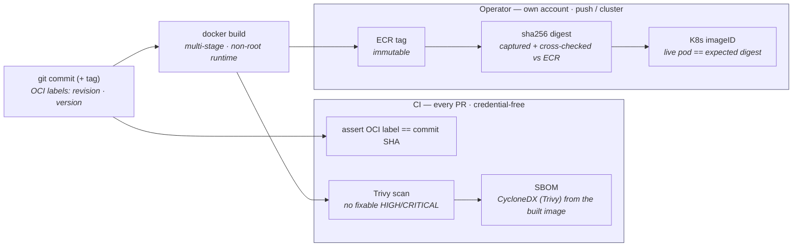

# Supply-Chain Provenance

**Title.** Supply-Chain Provenance — from a Git commit to the digest running in the
cluster.

**Purpose.** Show the verifiable source-to-runtime artifact chain, and which links
CI proves credential-free on every PR versus which are operator steps that need a
registry push or a live cluster.

Design of record: [supply-chain-provenance.md](../../supply-chain-provenance.md),
[container-image-scanning.md](../../container-image-scanning.md);
[ADR-035](../../decisions/ADR-035-container-image-scanning.md),
[ADR-036](../../decisions/ADR-036-sbom-and-image-provenance.md).

> **Status.** ✅ Implemented. The CI links run on every PR; the push/cluster links
> were exercised for the v1.7.0 release
> ([Sprint 8 SBOM/provenance evidence](../../proof/sprint-08-sbom-provenance-evidence.md)).

## Diagram



**What it proves / helps explain.**

- The chain is **verifiable, not asserted**: the OCI revision label is checked
  against the commit SHA in CI; the ECR tag is **immutable** so `tag → digest` can
  never change; the digest is captured from two independent sources; and the live
  pod's `imageID` is compared to the expected digest at runtime.
- The **credential boundary** is explicit: SBOM, scan, and the label assertion are
  credential-free and run on every PR; anything that pushes or touches the cluster is
  an operator step from their own account — CI never holds AWS credentials.

**Limitations (deliberately not claimed).** Builds are *equivalent-by-construction*,
**not** byte-reproducible-by-proof (deps pin by name, base by tag). Image signing
(keyless cosign) is **opt-in and off by default** — there is **no** admission-time
signature enforcement. Both are recorded as roadmap items in
[supply-chain-provenance.md § 6](../../supply-chain-provenance.md#6-what-this-covers-and-does-not).

## ASCII fallback

```text
git commit (+tag, OCI labels) ─┬─▶ docker build ─┬─▶ [CI] Trivy scan ─▶ CycloneDX SBOM
                               │                 │   [CI] assert label == commit SHA
                               │                 └─▶ [operator] ECR tag (immutable)
                               │                              └─▶ sha256 digest (2-source)
                               │                                        └─▶ K8s imageID == digest
                               └── CI links are credential-free; push/cluster links are operator-only
```
