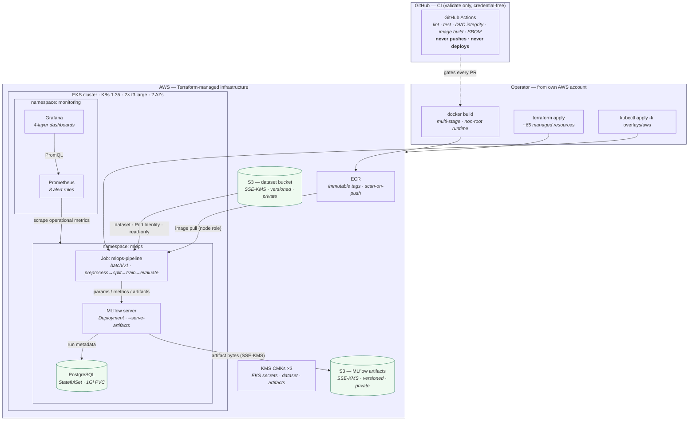

# Final Platform Architecture

**Title.** Final Platform Architecture — commit to observed run on AWS EKS.

**Purpose.** One screen that shows how a Git commit becomes a verified pipeline run
on real Amazon EKS, and how that run is observed — with the CI / operator /
Terraform / runtime **ownership boundaries** drawn explicitly.

Design of record: [architecture.md](../../architecture.md); the cloud platform is
[ADR-014](../../decisions/ADR-014-terraform-architecture.md) …
[ADR-027](../../decisions/ADR-027-s3-dataset-runtime-retrieval.md).

> **Status.** ✅ Reflects the platform validated on live EKS in Sprint 8
> (v1.7.0). It is a **short-lived validation environment**, not a production
> deployment — see *Limitations* below.

## Diagram



**What it proves / helps explain.**

- The **ownership split** a reviewer needs first: CI only *validates* (it never
  holds AWS credentials, never pushes an image, never deploys); the **operator**
  builds, pushes, and applies from their own account; **Terraform** owns the
  infrastructure; the **cluster** owns the runtime.
- The exact runtime data path: pipeline **image** from ECR, **dataset** from S3 by
  Pod Identity (no static keys), tracking to **MLflow → PostgreSQL** (metadata) and
  **S3** (artifacts, SSE-KMS), with **Prometheus/Grafana** observing operational
  signals.

**Limitations (deliberately not shown, because not built).** Single region, single
node group, local Terraform state, ephemeral `provision → prove → destroy` lifecycle
— **no** GitOps/ArgoCD, **no** service mesh, **no** remote state, **no** model
serving, **no** HA/DR, **no** distributed tracing. These are recorded in
[case-study.md § 15](../../case-study.md) and [roadmap.md](../../roadmap.md), not
implied here.

## ASCII fallback

```text
GitHub CI (validate only) ┈gates┈▶ Operator (own AWS account)
                                     │ build──▶ ECR ──image──┐
                                     │ terraform apply       │
                                     │ kubectl apply         ▼
   ┌─────────────────────── AWS (Terraform-managed) ───────────────────────┐
   │  ECR   KMS×3   S3(dataset, SSE-KMS)   S3(artifacts, SSE-KMS)           │
   │                    │Pod Identity            ▲                          │
   │   ┌──── EKS (1.35 · 2× t3.large · 2 AZs) ───┼──────────────┐          │
   │   │ ns mlops:  Job(preprocess→split→train→evaluate)         │          │
   │   │            └─▶ MLflow ──metadata──▶ PostgreSQL          │          │
   │   │                     └─────────artifacts────────────────▶          │
   │   │ ns monitoring:  Prometheus ◀─scrape─ mlops   Grafana─PromQL─▶Prom │
   │   └────────────────────────────────────────────────────────┘          │
   └───────────────────────────────────────────────────────────────────────┘
```
