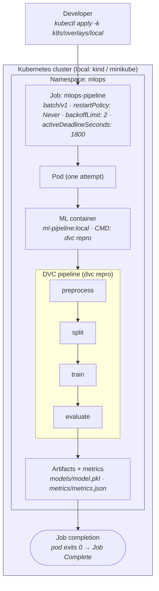

# Kubernetes Architecture

How the End-to-End ML Pipeline runs as a **Kubernetes-native batch workload**.
This document describes the architecture established across Sprint 5: the workload
model and namespace boundary (PR 1), the **runnable batch Job** with its real
image and lifecycle (PR 2), the configuration boundary (PR 3), and the
**enforced security context** (PR 4), and — critically — exactly which parts are
locally validatable today versus deferred to a production cluster.

> **Scope note.** Through PR 4 the manifests in [`k8s/`](../k8s/) define the
> namespace, a **runnable** batch `Job` — the real `ml-pipeline:local` image, the
> real `dvc repro` command, and a finite-run lifecycle — plus externalized
> **configuration** (`ConfigMap`), a **Secret** template (created out-of-band,
> never committed), a least-privilege **ServiceAccount** with the API-token
> automount off, and a **hardened `securityContext`** (non-root with an explicit
> uid/gid, no privilege escalation, all capabilities dropped, seccomp
> `RuntimeDefault`); all render cleanly through Kustomize. Resource requests/limits
> and CI validation are deferred to later PRs (see
> [§6](#6-identity--security-boundary) and
> [§7](#7-local-validation-vs-production-deferred)). The Job was **executed on a
> local Docker Desktop cluster** (2026-08-12) and its lifecycle verified end to
> end, but the pipeline does **not** complete yet: `dvc repro` aborts because the
> image has no SCM (`/app is not a git repository`), and a *green* run also needs
> the PR 3 data/credential wiring. One control — **read-only root filesystem — is
> deliberately deferred** (DVC writes state in-tree; see [§6](#6-identity--security-boundary)
> and [ADR-010](decisions/ADR-010-kubernetes-security-hardening.md)). Nothing here
> has been deployed to a production cluster, and **restricted Pod Security Standard
> compliance is not claimed**. Claims are kept to what the repository can currently
> prove.

Design of record: [ADR-009 — Kubernetes Workload Model](decisions/ADR-009-kubernetes-workload-model.md).
Related: [Architecture](architecture.md), [Containerization](containerization.md),
[ADR-005](decisions/ADR-005-containerization-strategy.md), [Roadmap](roadmap.md).

---

## 1. Why Kubernetes

The pipeline is already containerized ([ADR-005](decisions/ADR-005-containerization-strategy.md)):
a non-root, multi-stage image runs `dvc repro` to completion. Containerization
gives environment parity; it does not give a **scheduler, an environment
boundary, a declarative configuration/identity/security contract, or a
reproducible way to hand the workload to a platform** instead of a laptop.

Kubernetes is introduced to demonstrate that the containerized workload can be
expressed as a first-class platform citizen with explicit, reviewable contracts:

- a **namespace** as the environment/RBAC/quota boundary,
- a **workload primitive** that matches the workload's real lifecycle,
- **configuration and secrets** separated from the image (design contract; PR 3),
- a **security context** and **least-privilege identity** (design contract; PR 4),
- **resource requests/limits** for reproducible scheduling (design contract; PR 5).

This is deliberately *not* "add Kubernetes because it is on the résumé." The test
for every manifest is whether it lets the repository prove platform-engineering
judgment — workload modelling, boundaries, and trade-offs — not merely
familiarity with Kubernetes resource kinds.

---

## 2. Workload Architecture

The workload is the existing four-stage DVC pipeline, unchanged:
`preprocess → split → train → evaluate` (`dvc repro`). It is a **finite, batch,
file-based** computation: it starts, does work, writes artifacts and metrics, and
**exits**. There is no request/response surface and nothing to keep alive.



The same flow as ASCII (source also kept in
[`diagrams/kubernetes-architecture/`](diagrams/kubernetes-architecture/)):

```text
Developer ── kubectl apply ─▶ Kubernetes cluster
                                    │
                             Namespace: mlops
                                    │
                              Job: mlops-pipeline
                                    │
                                   Pod
                                    │
                              ML container (dvc repro)
                                    │
              preprocess ─▶ split ─▶ train ─▶ evaluate
                                                  │
                                     artifacts / metrics
                                                  │
                                          Job completion (exit 0)
```

The Kubernetes objects and their responsibilities:

| Object | Kind | Responsibility | This PR |
|---|---|---|---|
| `mlops` | `Namespace` | Environment / RBAC / quota / Pod Security boundary | ✅ |
| `mlops-pipeline` | `Job` (`batch/v1`) | Run the pipeline once to completion, with bounded retries | ✅ (runnable, PR 2) |
| `mlops-pipeline-config` | `ConfigMap` | Non-secret runtime config (`LOG_LEVEL`, `MLFLOW_TRACKING_URI`) | ✅ PR 3 |
| `mlops-pipeline-secret` | `Secret` | MLflow/DagsHub credentials — template only, real Secret created out-of-band | ✅ PR 3 (template) |
| `mlops-pipeline` | `ServiceAccount` | Least-privilege identity, **no API access** (`automountServiceAccountToken: false`) | ✅ PR 3 |

Note the absence of a `Service`, `Ingress`, or `Deployment`. That absence is a
design decision, not an omission: a batch Job exposes nothing and serves nothing,
so those primitives would be architecture inflation. See
[ADR-009](decisions/ADR-009-kubernetes-workload-model.md).

---

## 3. Why a `Job` (not a `Deployment`)

Summarized here; the full decision, alternatives, and lifecycle analysis are in
[ADR-009](decisions/ADR-009-kubernetes-workload-model.md).

| | Batch `Job` (chosen) | `Deployment` (rejected) |
|---|---|---|
| Intended workload | Run to completion, then stop | Keep a process alive indefinitely |
| Success = | Pod exits `0` → Job `Complete` | Process never exits |
| Pipeline exit `0` | Correct terminal state | Read as a crash → **restart loop** |
| Retry model | `backoffLimit` (bounded, then fail) | `restartPolicy: Always` (unbounded) |
| Health probes | Not applicable (no endpoint) | Expected (liveness/readiness) |
| Matches `dvc repro`? | ✅ finite computation | ❌ forces a fake long-running shape |

A `Deployment` would treat the pipeline's natural, successful exit as a failure
and restart it forever. The `Job` primitive is the one Kubernetes provides for
exactly this finite shape.

---

## 4. Lifecycle

A batch Job has a completion-oriented lifecycle rather than a
"stay-healthy-forever" one:

```text
Pending ─▶ Running ─▶ (pipeline executes) ─▶ Succeeded  ─▶ Job: Complete
                                          └▶ Failed ─▶ retry (≤ backoffLimit) ─▶ Job: Failed
```

- **restartPolicy: `Never`** — a failed attempt is not restarted in place; the
  Job controller schedules a fresh pod for each retry, so every attempt is a
  clean run of the deterministic pipeline.
- **backoffLimit: `2`** — a deterministic failure (bad input, config error) fails
  fast after bounded retries instead of looping.
- **activeDeadlineSeconds: `1800`** — a wall-clock ceiling for the whole Job (all
  retries). This is a completion-semantics safety net, **not** a CPU/memory
  resource limit: the pipeline finishes in ~1–2 minutes locally, so a Job still
  running after 30 minutes is stuck (e.g. a stalled MLflow/DagsHub call) and
  should fail with `DeadlineExceeded` rather than hold a pod indefinitely. It is
  deliberately generous; CPU/memory requests & limits and any tightening of this
  ceiling are deferred to the reliability PR (PR 5), as is
  `ttlSecondsAfterFinished` (finished-Job cleanup).
- **No liveness/readiness probes** — there is no live endpoint or long-running
  process to probe. This mirrors the container image, which ships **no
  `HEALTHCHECK`** by the same reasoning (see the `Dockerfile` and
  [ADR-005](decisions/ADR-005-containerization-strategy.md)). The build-time
  import smoke test plays the environment-validity role a probe otherwise would.

---

## 5. Configuration Boundary (implemented in PR 3)

Configuration is layered so that the image stays immutable and environment-
specific values live in the cluster, consistent with the twelve-factor approach
already used for the container ([ADR-005](decisions/ADR-005-containerization-strategy.md)).
Each variable below is one the code actually reads
(`src/pipeline_io.py::require_env`, `src/logging_config.py`, the MLflow client) —
classification is by sensitivity, not convenience:

| Layer | Holds | Kubernetes carrier | Committed? |
|---|---|---|---|
| Image | Application code + dependencies | Container image | Code only |
| Non-secret config | `LOG_LEVEL`, `MLFLOW_TRACKING_URI` (an endpoint, not a credential) | `ConfigMap` `mlops-pipeline-config` | Yes (no secrets) |
| Secrets | `MLFLOW_TRACKING_USERNAME`, `MLFLOW_TRACKING_PASSWORD` | `Secret` `mlops-pipeline-secret` | **Template only, never values** |

Both are wired into the Job with `envFrom` — the ConfigMap unconditionally (it is
in the Kustomize base) and the Secret with `optional: true`, so `kubectl apply -k`
succeeds before the operator creates the real Secret out-of-band from a git-ignored
`.env`. The classifying rule: `MLFLOW_TRACKING_URI` is a public endpoint (the same
host already committed as the DVC S3 remote in `.dvc/config`) and carries no
authority, so it is config; the username/token authenticate to it, so they are
secret. `LOG_LEVEL` is the pipeline's own knob.

Contract, held: **no real credentials are ever committed.** The repo ships only
[`k8s/base/secret.example.yaml`](../k8s/base/secret.example.yaml) with placeholder
values, and it is excluded from `base/kustomization.yaml` so no render or apply can
emit it. A *green* run still needs the remaining "make it runnable" work (an SCM in
the image + a mounted dataset); credentials are now injectable.

---

## 6. Identity & Security Boundary

**Identity (implemented in PR 3).** The workload runs under a dedicated
`ServiceAccount` (`mlops-pipeline`) rather than the namespace `default`, giving it
a named identity to scope any future policy to. Because the pipeline never calls
the Kubernetes API — it runs `dvc repro` and reaches only MLflow/DagsHub over
HTTPS — the account sets **`automountServiceAccountToken: false`** (on both the
ServiceAccount and the Job's pod template), so no API token is projected into the
pod. Verified on a live cluster: the applied pod had an empty `spec.volumes` and
empty container `volumeMounts` (no `kube-api-access-*` token volume, no
`/var/run/secrets/kubernetes.io/serviceaccount` mount). For the same reason **no
`Role`/`RoleBinding`** is defined — the workload needs no permissions, and granting
unused ones would violate least privilege.

**Security context (implemented in PR 4; [ADR-010](decisions/ADR-010-kubernetes-security-hardening.md)).**
The container image is already built to satisfy a restricted posture: a dedicated
non-root UID/GID (`10001`), no baked-in secrets or data, and a minimal surface
([ADR-005](decisions/ADR-005-containerization-strategy.md) §9). PR 4 *enforces*
that at the platform layer with a `securityContext` split across the two levels
Kubernetes defines:

- **Pod level** — `runAsNonRoot: true`, explicit `runAsUser: 10001` /
  `runAsGroup: 10001`, and `seccompProfile.type: RuntimeDefault`. The explicit
  numeric uid is **required**, not cosmetic: the image's `USER` is the *name*
  `appuser`, which the kubelet cannot verify as non-root, so `runAsNonRoot` alone
  would reject the pod with `CreateContainerConfigError`.
- **Container level** — `allowPrivilegeEscalation: false` (verified:
  `NoNewPrivs: 1`), `capabilities.drop: [ALL]` (the pipeline needs no Linux
  capabilities), and an explicit `readOnlyRootFilesystem: false`.

**Why read-only root filesystem is deferred (not skipped).** `dvc repro` mutates
DVC state **in-tree at the `/app` repo root** — under a read-only root FS its
first action fails with `[Errno 30] Read-only file system: '/app/.dvc/tmp'`, and
it further writes `/app/.dvc/cache`, rewrites `/app/dvc.lock`, and needs a writable
`/app/.git` for the SCM. Those paths sit at the repo root alongside the read-only
baked-in code and `.dvc/config`, so they cannot be carved out with `emptyDir`
without shadowing image files or making the code tree writable. Enabling it now
would make the container fail *earlier* than the pre-existing SCM blocker — i.e.
weaken a working workload to pass a checkbox. It is deferred to the same work that
makes the pipeline green in-cluster (relocating DVC cache/tmp/lock + SCM onto
declared writable volumes). Full rationale and evidence:
[ADR-010](decisions/ADR-010-kubernetes-security-hardening.md).

The hardening is **behaviour-neutral**: with it applied the Job reaches the *same*
pre-existing SCM blocker it hits without it (proven on the live cluster, below), so
no new failure mode was introduced. Restricted Pod Security Standard *compliance*
is **not** claimed — the fields are present and cluster-admitted, but no Pod
Security admission label or policy engine has validated the profile, and read-only
root is not met.

---

## 7. Local Validation vs Production-Deferred

A reviewer should be able to tell exactly what is proven today.

**Validated now (no cluster required) — actually performed in PR 2:**

- The manifests parse as YAML (round-tripped through PyYAML).
- `kustomize build k8s/base` and `kustomize build k8s/overlays/local` render
  successfully; the rendered container image is `ml-pipeline:local`, the command
  is `["dvc","repro"]`, and the Job carries `backoffLimit: 2`,
  `activeDeadlineSeconds: 1800`, `restartPolicy: Never`, and `namespace: mlops`.
- Config/identity wiring is asserted (PR 3): the rendered Job carries
  `serviceAccountName: mlops-pipeline`, `automountServiceAccountToken: false`, and
  an `envFrom` pulling the `mlops-pipeline-config` ConfigMap plus the optional
  `mlops-pipeline-secret`; the `ConfigMap` holds exactly `LOG_LEVEL` and
  `MLFLOW_TRACKING_URI` (no credential keys), and the **Secret template is not
  emitted** by the build.
- Security context is asserted (PR 4): 21 field/scope checks pass — the pod
  carries `runAsNonRoot`, `runAsUser`/`runAsGroup: 10001`, and
  `seccompProfile: RuntimeDefault`; the container carries
  `allowPrivilegeEscalation: false`, `capabilities.drop: [ALL]`, and an explicit
  `readOnlyRootFilesystem: false`; container-only fields are not at the pod level
  (and vice-versa); and no privilege/escape footguns (`privileged`, `hostNetwork`,
  `hostPID`, `hostIPC`) are present.
- Scope discipline is asserted: the rendered manifest still contains **no**
  `resources` block — that is PR 5.
- The workload model, boundaries, and trade-offs are documented and recorded in
  an ADR.

**Performed — an executed local cluster run (2026-08-12, Docker Desktop Kubernetes
v1.34.3):** the image was built and `kubectl apply -k k8s/overlays/local` was run
against a live cluster. The **Job lifecycle was verified end to end**:

- The `mlops` namespace and `mlops-pipeline` Job were created; the local image was
  resolved (no registry pull) and the container started (`Pending →
  ContainerCreating → Running`).
- The Job ran its designed retry lifecycle: **3 attempts total** — the initial pod
  plus `backoffLimit: 2` — each a *fresh* pod with `RESTARTS: 0` (confirming
  `restartPolicy: Never`), followed by a `BackoffLimitExceeded` event and a
  terminal **Job `Failed`** state.
- The pipeline itself did **not** complete: every attempt failed immediately with
  `ERROR: /app is not a git repository`. `dvc repro` requires an SCM, and the
  runtime image neither runs `git init` nor sets `core.no_scm`, so DVC aborts
  before evaluating any stage. This is an honest finding, not a success: the Job
  *mechanism* is proven on a real cluster, but a **green** end-to-end run needs the
  PR 3 "make it runnable" work — an SCM in the image (`git init` or
  `core.no_scm=true`), a mounted dataset (the image ships none by design), and
  MLflow/DagsHub credentials. Full OpenAPI schema validation via `kubectl apply`
  succeeds against this live cluster (the offline `--dry-run=client` could not
  reach an API server); `kubeconform` remains uninstalled.

**PR 3 config/identity — also verified on the live cluster (Docker Desktop
Kubernetes v1.34.3).** `kubectl apply -k k8s/overlays/local` created the
`ServiceAccount`, `ConfigMap`, and Job; the applied pod carried
`serviceAccountName: mlops-pipeline` with an **empty `spec.volumes`** and empty
container `volumeMounts` — proving `automountServiceAccountToken: false` (no
`kube-api-access-*` token volume mounted). The container **started** with the
optional Secret absent (confirming `secretRef.optional: true`), then failed at the
same known SCM blocker as PR 2 — i.e. this PR altered configuration and identity
only, not pipeline behavior. The existing test suite is likewise unaffected
(100 passed, 1 pre-existing skip). Resources were deleted afterward.

**PR 4 security context — verified against the real image and the live cluster.**
The controls were validated empirically, not asserted:

- **`docker run` probes** established the read-only-root incompatibility and the
  behaviour-neutrality directly. Under the full hardened runtime *minus* read-only
  root (`--user 10001:10001 --cap-drop ALL --security-opt no-new-privileges`), the
  core stack imports cleanly and `dvc repro` reaches the *same* pre-existing
  `/app is not a git repository` blocker; `NoNewPrivs: 1` is confirmed. Adding
  `--read-only --tmpfs /tmp` makes DVC fail *earlier* with
  `[Errno 30] Read-only file system: '/app/.dvc/tmp'` — the evidence behind
  deferring `readOnlyRootFilesystem` ([ADR-010](decisions/ADR-010-kubernetes-security-hardening.md)).
- **Live cluster (Docker Desktop v1.34.3).** `kubectl apply -k k8s/overlays/local`
  was **admitted** (proving the explicit numeric `runAsUser` satisfies
  `runAsNonRoot`; a name-only USER would have been rejected). The applied pod's
  enforced `spec.securityContext` reported
  `{runAsNonRoot:true, runAsUser:10001, runAsGroup:10001, seccompProfile:RuntimeDefault}`
  and the container's `{allowPrivilegeEscalation:false, capabilities:{drop:[ALL]},
  readOnlyRootFilesystem:false}`. `spec.volumes` was still empty (PR 3's token
  automount-off intact). The container **ran** and terminated at the same
  `/app is not a git repository` blocker (exit 255) — no security-induced
  regression. Resources were deleted afterward.
- No local static manifest scanner (`kubesec`, `kube-score`, `kube-linter`,
  `checkov`, `trivy`) is installed; the live-cluster admission + kubelet
  enforcement above served as the authoritative validation, and the manifest was
  **not** sent to any external scanning service.

**Production-deferred (explicitly out of scope for Sprint 5):**

- Any managed cluster (EKS/AKS/GKE), high availability, autoscaling, GitOps,
  service mesh, production observability, or model serving. These are future
  roadmap milestones ([roadmap.md](roadmap.md) v5–v6), not claims this sprint
  makes.

```text
Local render (kustomize)  ─▶  Local cluster run (Docker Desktop)  ─▶  Production deployment
   ✅ PR 1–4               ✅ executed — lifecycle + config/identity     ⬜ future roadmap
                              + hardened securityContext verified;
                              pipeline not green yet (SCM + data)
```

---

## 8. What This Does *Not* Claim

- It does not claim a **green** in-cluster pipeline run. The Job *mechanism* and
  the config/identity wiring are demonstrated on a local cluster, but `dvc repro`
  does not complete (it aborts at the SCM check); an end-to-end green run needs the
  remaining "make it runnable" work (SCM in the image + mounted data).
- It does not claim **restricted Pod Security Standard compliance**. PR 4 applies
  the individual `securityContext` controls that are compatible (non-root, no
  privilege escalation, all capabilities dropped, seccomp `RuntimeDefault`) and
  names the one that is not (read-only root filesystem, deferred with evidence in
  [ADR-010](decisions/ADR-010-kubernetes-security-hardening.md)); no admission
  controller has validated the profile.
- It does not claim production readiness or resource tuning — resource
  requests/limits are explicitly PR 5.
- It does not introduce an HTTP API, `Service`, or `Ingress`; the workload is
  batch and is modelled as such.

---

## Related Documentation

- [ADR-009 — Kubernetes Workload Model](decisions/ADR-009-kubernetes-workload-model.md)
- [Architecture](architecture.md)
- [Containerization Strategy](containerization.md)
- [ADR-005 — Containerization Strategy](decisions/ADR-005-containerization-strategy.md)
- [Roadmap](roadmap.md)
- [`k8s/README.md`](../k8s/README.md)
