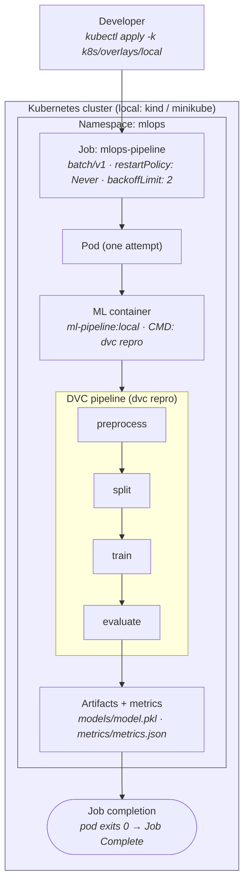

# Kubernetes Architecture

How the End-to-End ML Pipeline is designed to run as a **Kubernetes-native batch
workload**. This document describes the architectural foundation established in
Sprint 5, PR 1: the workload model, the namespace boundary, the configuration and
security boundaries (as design contracts), and — critically — exactly which parts
are locally validatable today versus deferred to a production cluster.

> **Scope note.** This is the *foundation* PR. The manifests in
> [`k8s/`](../k8s/) define the namespace and the workload **model** and render
> cleanly through Kustomize, but configuration/secrets, security hardening,
> resource limits, CI validation, and a demonstrated cluster run are deferred to
> later PRs (see [§7](#7-local-validation-vs-production-deferred)). Nothing
> described here has been deployed to a production cluster. Claims are kept to
> what the repository can currently prove.

Design of record: [ADR-009 — Kubernetes Workload Model](decisions/ADR-009-kubernetes-workload-model.md).
Related: [Architecture](architecture.md), [Containerization](containerization.md),
[ADR-005](decisions/ADR-005-containerization-strategy.md), [Roadmap](roadmap.md).

---

## 1. Why Kubernetes

The pipeline is already containerized ([ADR-005](decisions/ADR-005-containerization-strategy.md)):
a non-root, multi-stage image runs `dvc repro` to completion. Containerization
gives environment parity; it does not give a **scheduler, an environment
boundary, a declarative configuration/identity/security contract, or a
reproducible way to hand the workload to a platform** instead of a laptop.

Kubernetes is introduced to demonstrate that the containerized workload can be
expressed as a first-class platform citizen with explicit, reviewable contracts:

- a **namespace** as the environment/RBAC/quota boundary,
- a **workload primitive** that matches the workload's real lifecycle,
- **configuration and secrets** separated from the image (design contract; PR 3),
- a **security context** and **least-privilege identity** (design contract; PR 4),
- **resource requests/limits** for reproducible scheduling (design contract; PR 5).

This is deliberately *not* "add Kubernetes because it is on the résumé." The test
for every manifest is whether it lets the repository prove platform-engineering
judgment — workload modelling, boundaries, and trade-offs — not merely
familiarity with Kubernetes resource kinds.

---

## 2. Workload Architecture

The workload is the existing four-stage DVC pipeline, unchanged:
`preprocess → split → train → evaluate` (`dvc repro`). It is a **finite, batch,
file-based** computation: it starts, does work, writes artifacts and metrics, and
**exits**. There is no request/response surface and nothing to keep alive.



The same flow as ASCII (source also kept in
[`diagrams/kubernetes-architecture/`](diagrams/kubernetes-architecture/)):

```text
Developer ── kubectl apply ─▶ Kubernetes cluster
                                    │
                             Namespace: mlops
                                    │
                              Job: mlops-pipeline
                                    │
                                   Pod
                                    │
                              ML container (dvc repro)
                                    │
              preprocess ─▶ split ─▶ train ─▶ evaluate
                                                  │
                                     artifacts / metrics
                                                  │
                                          Job completion (exit 0)
```

The Kubernetes objects and their responsibilities:

| Object | Kind | Responsibility | This PR |
|---|---|---|---|
| `mlops` | `Namespace` | Environment / RBAC / quota / Pod Security boundary | ✅ |
| `mlops-pipeline` | `Job` (`batch/v1`) | Run the pipeline once to completion, with bounded retries | ✅ (model only) |
| ConfigMap | `ConfigMap` | Non-secret runtime config (params, flags) | ⬜ PR 3 |
| Secret | `Secret` | MLflow/DagsHub credentials — template only, never real values | ⬜ PR 3 |
| ServiceAccount | `ServiceAccount` | Least-privilege identity (likely no API access) | ⬜ PR 3 |

Note the absence of a `Service`, `Ingress`, or `Deployment`. That absence is a
design decision, not an omission: a batch Job exposes nothing and serves nothing,
so those primitives would be architecture inflation. See
[ADR-009](decisions/ADR-009-kubernetes-workload-model.md).

---

## 3. Why a `Job` (not a `Deployment`)

Summarized here; the full decision, alternatives, and lifecycle analysis are in
[ADR-009](decisions/ADR-009-kubernetes-workload-model.md).

| | Batch `Job` (chosen) | `Deployment` (rejected) |
|---|---|---|
| Intended workload | Run to completion, then stop | Keep a process alive indefinitely |
| Success = | Pod exits `0` → Job `Complete` | Process never exits |
| Pipeline exit `0` | Correct terminal state | Read as a crash → **restart loop** |
| Retry model | `backoffLimit` (bounded, then fail) | `restartPolicy: Always` (unbounded) |
| Health probes | Not applicable (no endpoint) | Expected (liveness/readiness) |
| Matches `dvc repro`? | ✅ finite computation | ❌ forces a fake long-running shape |

A `Deployment` would treat the pipeline's natural, successful exit as a failure
and restart it forever. The `Job` primitive is the one Kubernetes provides for
exactly this finite shape.

---

## 4. Lifecycle

A batch Job has a completion-oriented lifecycle rather than a
"stay-healthy-forever" one:

```text
Pending ─▶ Running ─▶ (pipeline executes) ─▶ Succeeded  ─▶ Job: Complete
                                          └▶ Failed ─▶ retry (≤ backoffLimit) ─▶ Job: Failed
```

- **restartPolicy: `Never`** — a failed attempt is not restarted in place; the
  Job controller schedules a fresh pod for each retry, so every attempt is a
  clean run of the deterministic pipeline.
- **backoffLimit: `2`** — a deterministic failure (bad input, config error) fails
  fast after bounded retries instead of looping. This is a workload-model choice,
  not tuned reliability engineering; `activeDeadlineSeconds` and
  `ttlSecondsAfterFinished` are deferred to the reliability PR (PR 5).
- **No liveness/readiness probes** — there is no live endpoint or long-running
  process to probe. This mirrors the container image, which ships **no
  `HEALTHCHECK`** by the same reasoning (see the `Dockerfile` and
  [ADR-005](decisions/ADR-005-containerization-strategy.md)). The build-time
  import smoke test plays the environment-validity role a probe otherwise would.

---

## 5. Configuration Boundary (design contract; implemented in PR 3)

Configuration is layered so that the image stays immutable and environment-
specific values live in the cluster, consistent with the twelve-factor approach
already used for the container ([ADR-005](decisions/ADR-005-containerization-strategy.md)):

| Layer | Holds | Kubernetes carrier | Committed? |
|---|---|---|---|
| Image | Application code + dependencies | Container image | Code only |
| Non-secret config | Pipeline params, runtime flags, `LOG_LEVEL` | `ConfigMap` | Yes (no secrets) |
| Secrets | MLflow/DagsHub credentials, tokens | `Secret` | **Template only, never values** |

Contract for this sprint: **no real credentials are ever committed**. The Secret
strategy (PR 3) ships a template/example with placeholder values only. The
current base `Job` carries none of this wiring yet — as written it renders and is
schema-valid, but a real cluster run of `dvc repro` needs the PR 3
data/credential wiring.

---

## 6. Security Boundary (design contract; implemented in PR 4)

The container image is already built to satisfy a restricted posture: a dedicated
non-root UID/GID (`10001`), no baked-in secrets or data, and a minimal surface
([ADR-005](decisions/ADR-005-containerization-strategy.md) §9). The Kubernetes
security context that *enforces* this at the platform layer —
`runAsNonRoot`, `allowPrivilegeEscalation: false`, dropped capabilities,
`seccompProfile: RuntimeDefault`, read-only root filesystem where compatible —
plus a least-privilege ServiceAccount with `automountServiceAccountToken: false`,
is the subject of **ADR-010** and lands in **PR 4**. It is intentionally absent
from the foundation manifest so that each control can be introduced and validated
against the real image rather than asserted blindly.

---

## 7. Local Validation vs Production-Deferred

A reviewer should be able to tell exactly what is proven today.

**Validatable now (this PR), no cluster required:**

- The manifests parse as YAML.
- `kustomize build k8s/base` and `kustomize build k8s/overlays/local` render
  successfully; the local overlay maps the image to the locally built
  `ml-pipeline:local`.
- The workload model, boundaries, and trade-offs are documented and recorded in
  an ADR.

**Local validation, next (PR 2), requires a local cluster (kind/minikube):**

- Building/side-loading the image, `kubectl apply -k k8s/overlays/local`, and
  observing the Job run to completion. See [`k8s/README.md`](../k8s/README.md).

**Production-deferred (explicitly out of scope for Sprint 5):**

- Any managed cluster (EKS/AKS/GKE), high availability, autoscaling, GitOps,
  service mesh, production observability, or model serving. These are future
  roadmap milestones ([roadmap.md](roadmap.md) v5–v6), not claims this sprint
  makes.

```text
Local render (kustomize)  ─▶  Local cluster run (kind)  ─▶  Production deployment
      ✅ this PR                    ⬜ PR 2                     ⬜ future roadmap
```

---

## 8. What This Foundation Does *Not* Claim

- It does not claim a running Kubernetes deployment — only rendered, schema-valid
  manifests and a documented model.
- It does not claim production readiness, security hardening, or resource tuning —
  those are explicitly later PRs.
- It does not introduce an HTTP API, `Service`, or `Ingress`; the workload is
  batch and is modelled as such.

---

## Related Documentation

- [ADR-009 — Kubernetes Workload Model](decisions/ADR-009-kubernetes-workload-model.md)
- [Architecture](architecture.md)
- [Containerization Strategy](containerization.md)
- [ADR-005 — Containerization Strategy](decisions/ADR-005-containerization-strategy.md)
- [Roadmap](roadmap.md)
- [`k8s/README.md`](../k8s/README.md)
