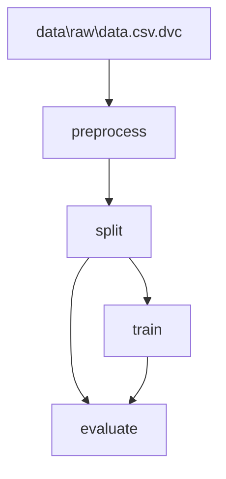

# Pipeline Contract

- **Status:** Active (as-built) — reconciled to the implementation delivered in
  Sprint 4 (v1.3.0) and the held-out evaluation milestone (proof hardening)
- **Date:** 2026-08-09 (originally drafted 2026-08-05 as a design contract)
- **Owner:** Asad Hanif
- **Related:** [ADR-007 (Held-Out Evaluation)](decisions/ADR-007-held-out-evaluation.md),
  [ADR-006 (Pipeline Reproducibility)](decisions/ADR-006-pipeline-reproducibility.md),
  [ADR-003 (Why DVC)](decisions/ADR-003-why-dvc.md),
  [ADR-002 (Why MLflow)](decisions/ADR-002-why-mlflow.md),
  [architecture.md](architecture.md), [dvc.yaml](../dvc.yaml), [params.yaml](../params.yaml)

---

## 1. Purpose

This document defines the **engineering contract** for the ML pipeline: what each
stage consumes, what it produces, who owns each artifact, where external services
sit, and what counts as a valid, reproducible run.

It began (Sprint 4, PR 1) as a **design contract** distinguishing what the
repository did then (CURRENT) from what the sprint would implement (TARGET). The
implementation PRs (PR 2–PR 6) have since landed, and a subsequent **proof
hardening** milestone added a dedicated `split` stage so that evaluation runs on
**held-out** data, so this document now describes the **as-built** pipeline. The
wiring and configuration assertions below are **enforced automatically** by the
`contract` test suite
([`tests/contract/test_pipeline_contract.py`](../tests/contract/test_pipeline_contract.py))
and by CI (`dvc dag` + `dvc status`), so this is not a claim on trust — a broken
contract fails a pull request.

One deviation from the original target **remains open and is documented
honestly** rather than hidden: no `dvc.lock` is committed (part of D7). The former
in-sample-evaluation gap (D5) is now **resolved** — `train` and `evaluate` consume
**disjoint** datasets produced by an explicit `split` stage. See
[§8](#8-evaluation-boundary) and [§11](#11-deviation-status-sprint-4).

---

## 2. Logical Pipeline

The pipeline is an artifact-lineage chain that **forks at the split** into a
training path and a held-out evaluation path:

```text
raw data
   │
   ▼
preprocess               (stage)
   │
   ▼
processed data           (artifact)
   │
   ▼
split                    (stage)
   │
   ├──────────────┐
   ▼              ▼
train data     held-out eval data   (artifacts)
   │              │
   ▼              │
train (stage)     │
   │              │
   ▼              │
model ───────▶ evaluate (stage)     (model + held-out data → metrics)
                  │
                  ▼
               metrics              (artifact)
```

Experiment metadata (parameters, metrics, model registry) is logged to **MLflow
on DagsHub** as a side channel from `train` and `evaluate`; it is a boundary, not
a pipeline stage (see [§9](#9-external-service-boundaries)). Data and artifact
lineage is owned by **DVC** (see
[ADR-006](decisions/ADR-006-pipeline-reproducibility.md)).

**As wired today** (`dvc.yaml`), confirmed by `dvc dag`:

```text
data/raw/data.csv.dvc
        │
        ▼
   preprocess ──▶ data/processed/data.csv
                        │
                        ▼
                     split ──▶ data/processed/train.csv ──▶ train ──▶ model
                        │                                              │
                        └──▶ data/processed/test.csv ──▶ evaluate ◀───┘
                                                            │
                                                            ▼
                                                  metrics/metrics.json
```

`preprocess` is the only stage that reads the raw file; `split` is the only stage
that reads the processed dataset and is the **single owner** of both partitions;
`train` consumes **only** `data/processed/train.csv`; `evaluate` consumes **only**
`data/processed/test.csv` (the held-out partition) plus the model, and produces the
metrics artifact. Because `train` and `evaluate` read **disjoint** files, the
reported accuracy is genuinely out-of-sample. This is the chain DVC actually
builds (`dvc dag` output in [§8](#8-evaluation-boundary)).

---

## 3. Stage Contracts

Each stage documents its **purpose**, **inputs**, **outputs**, **configuration**,
**artifact ownership**, and **failure conditions**. Paths and parameter names are
stated exactly as they appear in the repository.

### 3.1 `preprocess`

**Purpose:** Produce the processed dataset that training consumes, from the raw
dataset.

| Aspect | As built |
|--------|----------|
| Command | `python src/preprocess.py` |
| Input (data) | `data/raw/data.csv` |
| Input (code) | `src/preprocess.py` |
| Config keys | `preprocess.input`, `preprocess.output` (from `params.yaml`) |
| Output | `data/processed/data.csv` — **consumed by `split`** |
| DVC declaration | `deps: data/raw/data.csv, src/preprocess.py`; `params: preprocess.input, preprocess.output`; `outs: data/processed/data.csv` |
| Behavior | Reads the raw CSV and re-writes it **with its header** (`header=True, index=False`); performs no cleaning or transformation today. The header is preserved so `split` (and downstream `train`/`evaluate`) can select the `Outcome`/feature columns by name (resolving the former headerless-output mismatch, D8). |

**Artifact ownership:** `preprocess` **owns** `data/processed/data.csv`. No other
stage writes it.

**Failure conditions (via typed exceptions):**

- `DataError` — raw input missing, empty, or not valid CSV.
- `DataError` — processed output directory/file cannot be written.
- `ConfigError` — `params.yaml` missing, unparseable, or missing
  `preprocess.input`/`preprocess.output`.

### 3.2 `split`

**Purpose:** Partition the processed dataset into a **training** set and a
**held-out evaluation** set, so training and evaluation consume disjoint data.
This stage is what makes held-out evaluation a property of the DAG rather than a
convention (see [ADR-007](decisions/ADR-007-held-out-evaluation.md)).

| Aspect | As built |
|--------|----------|
| Command | `python src/split.py` |
| Input (data) | `data/processed/data.csv` — the `preprocess` output, read from `params['split']['input']` |
| Input (code) | `src/split.py` |
| Config keys read by code | `split.input`, `split.train_output`, `split.test_output`, `split.target`, `split.test_size`, `split.random_state` |
| Config keys declared in `dvc.yaml` | `split.input`, `split.train_output`, `split.test_output`, `split.target`, `split.test_size`, `split.random_state` — the same set the code reads |
| Output | `data/processed/train.csv` (**consumed by `train`**) and `data/processed/test.csv` (**consumed by `evaluate`**) |
| DVC declaration | `deps: data/processed/data.csv, src/split.py`; `params: split.input, split.train_output, split.test_output, split.target, split.test_size, split.random_state`; `outs: data/processed/train.csv, data/processed/test.csv` |
| Behavior | Reads the processed CSV; performs a **stratified** `train_test_split(test_size=split.test_size, random_state=split.random_state, stratify=<target>)`; writes both partitions **with headers** (`header=True, index=False`). The pure computation (`split_dataset`) is IO-free and MLflow-free, and asserts the two partitions are **disjoint** (no shared row → no leakage) and **exhaustive** (their union is the input, no row lost). Crossing no tracking boundary, `split` needs no `MLFLOW_TRACKING_URI`. |

**Artifact ownership:** `split` **owns** both `data/processed/train.csv` and
`data/processed/test.csv`. No other stage writes either file; `train` reads only
the first and `evaluate` reads only the second.

**Failure conditions (via typed exceptions):**

- `DataError` — processed input missing/empty/invalid, or missing the `target`
  column.
- `DataError` — the split cannot be stratified (e.g. `test_size` out of range, or a
  class with too few rows to appear in both partitions) — surfaced as a typed error
  naming the cause, not a raw scikit-learn `ValueError`.
- `DataError` — a partition output directory/file cannot be written.
- `ConfigError` — `params.yaml` missing, unparseable, or missing any required
  `split.*` key.

**Determinism.** `split.random_state` seeds the partition, so the exact rows held
out do not drift between runs — the reproducibility guarantee for the evaluation
boundary.

### 3.3 `train`

**Purpose:** Fit and select a model from the **training** dataset and persist it
as the model artifact.

| Aspect | As built |
|--------|----------|
| Command | `python src/train.py` |
| Input (data) | `data/processed/train.csv` — the `split` **training** output, read from `params['train']['input']`; never the held-out partition |
| Input (code) | `src/train.py` |
| Config keys read by code | `train.input`, `train.output`, `train.target`, `train.random_state`, `train.n_estimators`, `train.max_depth` |
| Config keys declared in `dvc.yaml` | `train.input`, `train.output`, `train.target`, `train.random_state`, `train.n_estimators`, `train.max_depth` — the same set the code reads |
| Output | `models/model.pkl` |
| DVC declaration | `deps: data/processed/train.csv, src/train.py`; `outs: models/model.pkl` |
| Behavior | Requires `MLFLOW_TRACKING_URI`; performs an **internal** `train_test_split(test_size=0.20, random_state=...)` **within the training set** (a validation split for in-training reporting — never the held-out evaluation set); builds a `RandomForestClassifier` with the configured `n_estimators`/`max_depth`/`random_state`; runs `GridSearchCV` (cv=3) over leaf/split regularization (`min_samples_split`, `min_samples_leaf`); logs params/metrics/artifacts to MLflow and conditionally registers the model; pickles the best estimator. The ML computation (`run_training`) is IO-free and MLflow-free. |

**Artifact ownership:** `train` **owns** `models/model.pkl`. It also owns its
MLflow run (params, metrics, model registry entry).

**Failure conditions (via typed exceptions):**

- `DataError` — dataset missing/empty/invalid, or missing the `target` column.
- `ConfigError` — `MLFLOW_TRACKING_URI` unset/empty; or required `train.*` params
  absent.
- `TrackingError` — MLflow logging fails (URI, credentials, or network).
- `ModelError` — the fitted estimator cannot be pickled.

**Configured parameters govern the run.** `random_state` seeds both the split and
the estimator; `n_estimators`/`max_depth` are set on the estimator (no longer
shadowed by a hardcoded grid). These parameters are therefore live, and training
is deterministic given the same inputs and parameters (resolving the former inert
parameters / non-determinism, C5 / D7-seeding).

### 3.4 `evaluate`

**Purpose:** Measure the trained model against the **held-out** evaluation dataset
and emit metrics.

| Aspect | As built |
|--------|----------|
| Command | `python src/evaluate.py` |
| Input (data) | `data/processed/test.csv` — the `split` **held-out** output, read from `params['evaluate']['data']`; never the training partition |
| Input (model) | `models/model.pkl` — the `train` output, read from `params['evaluate']['model']` |
| Input (code) | `src/evaluate.py` |
| Config keys read by code | `evaluate.data`, `evaluate.model`, `evaluate.target`, `evaluate.metrics` (section named `evaluate`, aligned with the stage) |
| Config keys declared in `dvc.yaml` | `evaluate.data`, `evaluate.model`, `evaluate.target`, `evaluate.metrics` |
| Output | `metrics/metrics.json` — a DVC-tracked **metrics artifact** (`cache: false`) |
| DVC declaration | `deps: data/processed/test.csv, models/model.pkl, src/evaluate.py`; `params: evaluate.data, evaluate.model, evaluate.target, evaluate.metrics`; `metrics: metrics/metrics.json (cache: false)` |
| Behavior | Requires `MLFLOW_TRACKING_URI`; loads the model; predicts over the **held-out** dataset; computes `accuracy_score`; writes the metrics artifact **before** the MLflow boundary; logs the metric to MLflow. The scoring (`compute_metrics`) is IO-free and MLflow-free. |

**Artifact ownership:** `evaluate` **owns** `metrics/metrics.json` and its MLflow
evaluation run.

**Failure conditions (via typed exceptions):**

- `DataError` — dataset missing/empty/invalid, or missing the `target` column.
- `ConfigError` — `MLFLOW_TRACKING_URI` unset/empty; or required `evaluate.*`
  params absent.
- `ModelError` — model file missing/corrupt, or the model fails to predict on the
  provided features (e.g. a feature-schema mismatch).
- `TrackingError` — MLflow logging fails (URI, credentials, or network).

**Evaluation boundary (RESOLVED).** `evaluate.data` points at
`data/processed/test.csv` — the held-out partition `split` produces and `train`
never reads — so the reported `accuracy` is a genuine **out-of-sample** figure.
The disjointness is enforced by the `contract` lineage tests
(`test_train_and_evaluate_consume_disjoint_datasets`) and by `split`'s own runtime
assertions. See [§8](#8-evaluation-boundary).

---

## 4. Configuration & Parameter Contract

**`params.yaml` is the single authoritative source of pipeline parameters.**
`dvc.yaml` references parameter *keys*; the stage code reads parameter *values*.
All three agree — and the `contract` tests enforce that agreement on every change.

### 4.1 Current `params.yaml` sections

```yaml
preprocess:
  input:  data/raw/data.csv
  output: data/processed/data.csv

split:
  input:        data/processed/data.csv
  train_output: data/processed/train.csv
  test_output:  data/processed/test.csv
  target: Outcome
  test_size: 0.2
  random_state: 42

train:
  input:  data/processed/train.csv
  output: models/model.pkl
  target: Outcome
  random_state: 42
  n_estimators: 100
  max_depth: 5

evaluate:
  data:   data/processed/test.csv
  model:  models/model.pkl
  target: Outcome
  metrics: metrics/metrics.json
```

### 4.2 Configuration contract — status

The five inconsistencies recorded in the original design contract (C1–C5) are all
resolved. They are retained here as a verification checklist, each now enforced by
a named `contract` test:

| # | Former inconsistency | Status | Enforced by |
|---|----------------------|--------|-------------|
| C1 | `dvc.yaml` `train` declared `train.data`/`train.model`, absent from `params.yaml`. | **Resolved** — `dvc.yaml` references `train.input`/`train.output`, which exist. | `test_every_dvc_param_key_exists_in_params_yaml` |
| C2 | `train.py` read `train.input`/`train.output` while `dvc.yaml` named other keys. | **Resolved** — code, `params.yaml`, and `dvc.yaml` use one naming. | same as C1 + `test_declared_outputs_match_params` |
| C3 | `evaluate.py` read a section named `test`, not `evaluate`. | **Resolved** — the section is `evaluate`, aligned with the stage. | `test_no_orphaned_params` |
| C4 | `dvc.yaml` `evaluate` declared no params. | **Resolved** — `evaluate.data/model/target/metrics` are declared. | `test_no_orphaned_params` |
| C5 | `train.random_state`/`n_estimators`/`max_depth` were loaded but not applied. | **Resolved** — all three govern the split/estimator. | covered by stage unit tests (`tests/unit/test_train.py`) |

### 4.3 Parameter contract rules (enforced)

1. Every parameter a stage reads is defined in `params.yaml`.
2. Every parameter key `dvc.yaml` references exists in `params.yaml`.
3. No parameter is declared for a stage yet referenced by no stage (**no orphaned
   params**).
4. Parameter section names correspond to their stage names.
5. Parameters that affect reproducibility (e.g. seeds) are declared and applied.

---

## 5. Artifact Ownership & Lineage

Each artifact has exactly **one** producing stage ("owner"). Consumers may read it
but never write it. `test_each_artifact_has_exactly_one_producer` enforces the
single-owner rule; `test_processed_data_is_consumed_not_orphaned` and
`test_split_outputs_are_consumed_not_orphaned` enforce that `preprocess`'s and
`split`'s outputs each have a downstream consumer.

| Artifact | Owner (writes) | Consumers (read) | Tracking |
|----------|----------------|------------------|----------|
| `data/raw/data.csv` | External / ingestion (`data/raw/data.csv.dvc`) | `preprocess` only | DVC (`.dvc` pointer) |
| `data/processed/data.csv` | `preprocess` | `split` only | DVC stage output |
| `data/processed/train.csv` | `split` | `train` only | DVC stage output |
| `data/processed/test.csv` | `split` | `evaluate` only | DVC stage output |
| `models/model.pkl` | `train` | `evaluate` | DVC stage output |
| `metrics/metrics.json` | `evaluate` | downstream reporting / CI | DVC metric (`cache: false`) |
| MLflow run (params, metrics, registry) | `train`, `evaluate` | MLflow/DagsHub UI | MLflow (external) |

**Rules:**

- A stage writes only the artifact(s) it owns.
- The raw dataset is owned upstream of the pipeline (DVC-tracked pointer) and is
  not mutated by any stage.
- The raw dataset has exactly one direct consumer (`preprocess`); the processed
  dataset has exactly one direct consumer (`split`).
- Training and evaluation consume **disjoint** partitions: `train` reads only
  `data/processed/train.csv`, `evaluate` reads only `data/processed/test.csv`.
  Neither reads the raw file or the other's partition.

---

## 6. Stage Input/Output Summary

| Stage | Input | Output | Configuration |
|-------|-------|--------|---------------|
| `preprocess` | Raw dataset | Processed dataset | `preprocess.input`, `preprocess.output` |
| `split` | Processed dataset | Training dataset + held-out dataset | `split.*` (in/out paths, target, `test_size`, seed) |
| `train` | Training dataset | Model artifact | `train.*` (target + seed + tree hyperparameters) |
| `evaluate` | Model + held-out dataset | Metrics artifact | `evaluate.*` (data, model, target, metrics) |

The `train` "input" and the `evaluate` "evaluation dataset" are now **distinct,
disjoint** files (`train.csv` vs `test.csv`) produced by the `split` stage, so the
reported accuracy is out-of-sample — see [§8](#8-evaluation-boundary).

---

## 7. Reproducibility Expectations

Reproducibility is an **engineering requirement**, not a nicety (rationale in
[ADR-006](decisions/ADR-006-pipeline-reproducibility.md)).

**Achieved:**

1. **Declared lineage.** The pipeline is reconstructable from declared inputs,
   parameters, and dependencies. `dvc.yaml` accurately models the real DAG
   `raw → preprocess → processed → split → {train → model, held-out} → evaluate →
   metrics`, confirmed by `dvc dag` and the `contract` lineage tests.
2. **Deterministic given fixed inputs + params + seed.** The train/held-out
   partition is seeded from `split.random_state`, and the estimator (plus train's
   internal validation split) from `train.random_state`; repeated runs on the same
   inputs and params yield the same partitions, model, and metrics — so the exact
   rows held out for evaluation do not drift between runs.
3. **CI enforcement.** Pipeline integrity (valid DAG, consistent params, buildable
   graph, correct lineage) is validated automatically on every push and pull
   request, without production credentials or live external services (see
   [CI/CD](ci-cd.md)).

**Remaining reproducibility limitations (documented, not fixed):**

4. **No committed `dvc.lock`.** The resolved dependency hashes for a run are not
   pinned, so `dvc status` cannot serve as a true "up to date" drift gate and CI
   validates the pipeline **definition**, not a locked **execution**. Committing a
   `dvc.lock` requires a runnable dataset in CI (the raw dataset is remote-only
   today).
5. **No in-CI execution.** CI does not run `dvc repro` — the first stage's data
   dependency lives only on the DagsHub remote. A future execution check would use
   a small committed fixture dataset plus a committed `dvc.lock`.
6. **Dependencies/base image are name-pinned, not digest-pinned** (carried from
   Sprint 3). Byte-for-byte repeatable rebuilds need hash/digest pinning
   ([ADR-005](decisions/ADR-005-containerization-strategy.md)). Until then,
   "reproducible" means *logically* reproducible (same declared inputs, params,
   and seed), not bit-for-bit.

---

## 8. Evaluation Boundary

The evaluation boundary defines **what data proves what claim.**

**As built (held-out; deviation D5 resolved):**

- A dedicated `split` stage partitions `data/processed/data.csv` into
  `data/processed/train.csv` and `data/processed/test.csv` with a **stratified,
  seeded** `train_test_split`, and asserts the two partitions are disjoint and
  exhaustive.
- `train` fits **only** on `data/processed/train.csv`. Its internal
  `train_test_split` (20%, seeded) is a *validation* split taken **within the
  training set** for in-training reporting — it never touches the held-out file.
- `evaluate` scores the model **only** on `data/processed/test.csv`, which `train`
  never reads.
- Consequently the `accuracy` written to `metrics/metrics.json` and logged to
  MLflow is a genuine **out-of-sample** metric.

**How the boundary is guaranteed (three independent layers):**

1. **DAG topology** — `dvc.yaml` declares `train` depending on `train.csv` and
   `evaluate` on `test.csv`; `dvc dag` shows the fork. `split` is the single owner
   of both partitions.
2. **Contract tests** — `test_train_and_evaluate_consume_disjoint_datasets`
   asserts `train`'s dataset dependencies `== {train.csv}`, `evaluate`'s
   `== {test.csv}`, and that the two sets are disjoint; parsed offline from
   `dvc.yaml`/`params.yaml`, so a regression that repointed either stage at a
   shared file fails CI.
3. **Runtime assertions** — `split_dataset` asserts
   `train.index ∩ test.index == ∅` and `len(train) + len(test) == len(input)`, so
   a leak or a lost row aborts the run with a clear message.

**Confirmed by `dvc dag`:**



**Honest-evaluation rule (still in force):** no model-performance claim is made
unless the methodology supports it. The accuracy is now a legitimate held-out
estimate, but two caveats remain: it is a **single split** (not
cross-validated), and the held-out set is small (`test_size = 0.2`), so the
figure carries the variance of one 20% partition rather than a confidence
interval. See [§11](#11-deviation-status-sprint-4).

---

## 9. External Service Boundaries

The pipeline touches two external systems. Both are **boundaries**, isolated from
core ML logic.

| Boundary | Used by | Purpose | Required to run? | Testability |
|----------|---------|---------|------------------|-------------|
| **MLflow on DagsHub** | `train`, `evaluate` | Experiment tracking, metric logging, model registry | **Yes to run a stage end-to-end** — both stages call `require_env("MLFLOW_TRACKING_URI")`. | **Not required for tests.** All MLflow access is funneled through [`src/tracking.py`](../src/tracking.py), imported *lazily* at the boundary. The stages' ML computation (`run_training`, `compute_metrics`) imports no MLflow, and tests replace `tracking` with an in-memory stub. |
| **DVC remote (S3-compatible, DagsHub)** | data/model retrieval | Store/fetch DVC-tracked data & models | Needed to `dvc pull`/`push` artifacts; **not** needed to reason about or validate the graph. | Graph validation in CI (`dvc dag`, local `dvc status`, contract tests) requires no remote credentials. |

**Environment/config boundary:**

- `MLFLOW_TRACKING_URI` (and DagsHub credentials) are provided via `.env`
  (`python-dotenv`); see [`.env.example`](../.env.example). Secrets are never
  committed.
- **Contract rule (enforced):** ordinary **unit tests do not require** live MLflow,
  DagsHub, network access, or production credentials. The `stub_tracking` fixture
  neutralizes the tracking boundary; the `contract` tests parse files only. Tests
  that genuinely exercise external behavior would be **integration** tests, marked
  as such. (Rationale: [ADR-006](decisions/ADR-006-pipeline-reproducibility.md).)

> **Nuance, stated honestly.** The MLflow *coupling* was removed from the ML
> *computation*, which is what makes the stages unit-testable. The stage
> *orchestration* (`train()` / `evaluate()`) still calls `require_env` and will
> refuse to run end-to-end without `MLFLOW_TRACKING_URI` set. That is by design —
> MLflow logging is a preserved capability, not an optional one — and it does not
> weaken testability, because tests exercise the pure functions and the stubbed
> boundary, not the network.

---

## 10. What Constitutes a Valid Pipeline Execution

A pipeline execution is **valid** when all of the following hold.

**Structural validity (enforced by `contract` tests + `dvc dag` in CI):**

1. `dvc.yaml` models the DAG `raw → preprocess → processed → split →
   {train.csv → train → model, test.csv} → evaluate → metrics`, with `train`
   depending on the training partition and `evaluate` depending on the model and
   the disjoint held-out partition.
2. Every `dvc.yaml` parameter key exists in `params.yaml`; no orphaned params.
3. Each stage reads only its declared inputs and writes only the artifact(s) it
   owns.
4. A declared metrics artifact is produced by `evaluate`.

**Execution validity:**

5. Each stage exits non-zero on failure with a typed, actionable error, stopping
   `dvc repro`/CI (via `stage_runner` + typed exceptions).
6. Required configuration is present and validated before compute (via
   `load_params` / `require_env`).
7. Given identical inputs, params, and seed, the run is reproducible (seeded
   split and estimator).

**Evidence validity:**

8. Metrics are emitted as a first-class artifact (`metrics/metrics.json`), not only
   to logs/MLflow.
9. Any performance claim is backed by an evaluation whose methodology supports it.
   **The evaluation is now held-out (§8): `evaluate` scores the model on a disjoint
   partition `train` never saw, so the accuracy is a legitimate out-of-sample
   estimate — bounded by the single-split, small-test-set caveats in §8/§11.**
10. *(Not yet achievable)* `dvc status` reports "up to date" for an unchanged,
    committed pipeline — this needs a committed `dvc.lock`, which is absent (§7).

An execution that logs an `accuracy` number but violates the evaluation boundary
(§8) — for example by repointing `evaluate.data` at the training partition — is
**not** a valid basis for a generalization claim even though the process exits 0.
The `contract` disjointness test exists precisely to make that regression fail CI.

---

## 11. Deviation Status (Sprint 4)

The eight deviations the design contract enumerated, with their status after the
Sprint 4 implementation PRs and the subsequent held-out evaluation milestone:

| ID | Deviation (original) | Status |
|----|----------------------|--------|
| D1 | `preprocess` output orphaned; `train` read raw data. | ✅ **Resolved** — the processed dataset flows `preprocess → split → train`; raw is `preprocess`-only. |
| D2 | `dvc.yaml` `train` params (`train.data`/`train.model`) mismatched `params.yaml`/code. | ✅ **Resolved** — one authoritative naming (`train.input`/`train.output`). |
| D3 | `evaluate` read a `test` section; no evaluate params in `dvc.yaml`. | ✅ **Resolved** — `evaluate` section; params declared in the graph. |
| D4 | No metrics artifact (MLflow/log only). | ✅ **Resolved** — DVC-tracked `metrics/metrics.json`. |
| D5 | `evaluate` scores on the full training data (in-sample). | ✅ **Resolved** — a dedicated `split` stage holds out `data/processed/test.csv`; `train` fits on `train.csv`, `evaluate` scores on the disjoint `test.csv`. Enforced by the DAG, the `contract` disjointness test, and `split`'s runtime assertions (§8). Remaining refinements (cross-validation, larger/CI-visible held-out set) are quality caveats, not correctness gaps. |
| D6 | ML logic coupled to MLflow, blocking isolated tests. | ✅ **Resolved** — MLflow isolated behind `tracking.py` (lazy import); ML compute is unit-tested without the service. Stage orchestration still requires the URI to *run* end-to-end (by design; §9). |
| D7 | Non-deterministic training; `random_state` unused; no `dvc.lock`. | 🟡 **Partially resolved** — seeded and deterministic (`split.random_state` + `train.random_state` applied). **`dvc.lock` still absent** (§7). |
| D8 | Processed CSV written headerless, incompatible with the `Outcome` column contract. | ✅ **Resolved** — every stage writes `header=True`; partitions are consumable by column name. |

**Summary:** seven of eight deviations fully resolved; D7 partially resolved
(determinism yes, `dvc.lock` no). The `dvc.lock`/execution-check portion of D7 is
now the pipeline's single remaining known limitation after this milestone. The
former highest-priority gap — in-sample evaluation (D5) — is closed.

---

## 12. Out of Scope

This contract does **not** cover, and Sprint 4 did not deliver: Kubernetes, Helm,
Terraform, cloud deployment, continuous delivery, model serving, Prometheus/Grafana,
distributed training, a production MLflow deployment, container registry publishing,
Trivy/SBOM/image signing. These belong to later milestones (see
[roadmap.md](roadmap.md) and the Sprint 4 plan).

This document also does not prescribe the *internal algorithm* of preprocessing or
the *model family* — only the contracts (inputs, outputs, ownership, boundaries,
reproducibility) around them.

---

## 13. Change Control

- This contract is versioned with the repository. Material changes to any stage's
  input/output, ownership, evaluation boundary, or external-service posture must
  update this document in the same PR.
- Where implementation and this contract diverge, **the divergence is a defect** —
  either the implementation or the contract is corrected; they are not allowed to
  drift silently. The `contract` test suite makes most such divergences fail CI
  automatically.
- The decision rationale behind this contract lives in
  [ADR-006](decisions/ADR-006-pipeline-reproducibility.md).
