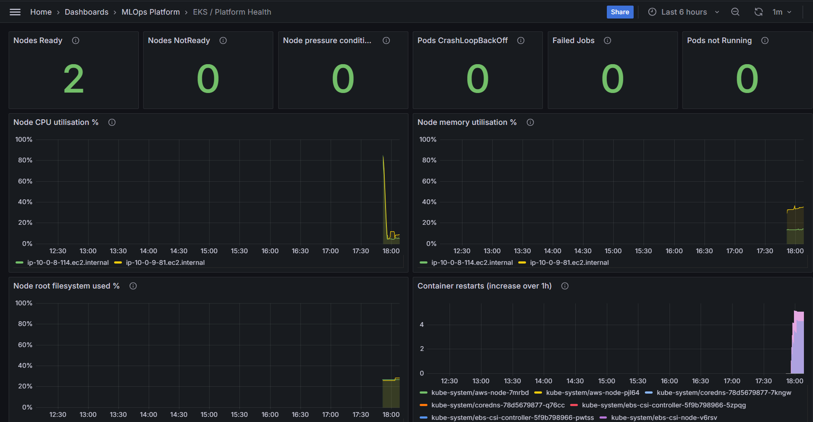
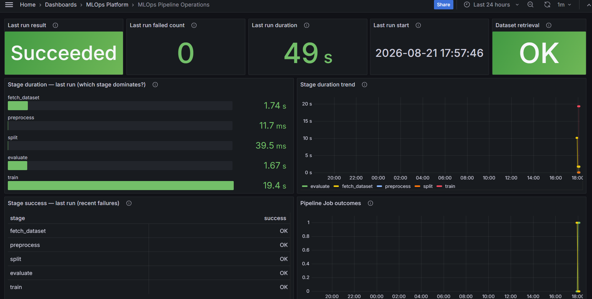
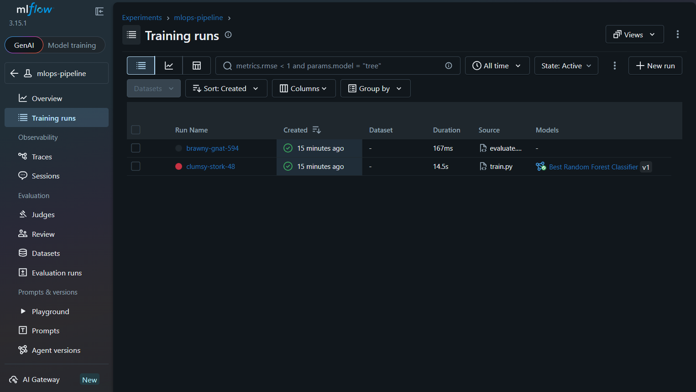
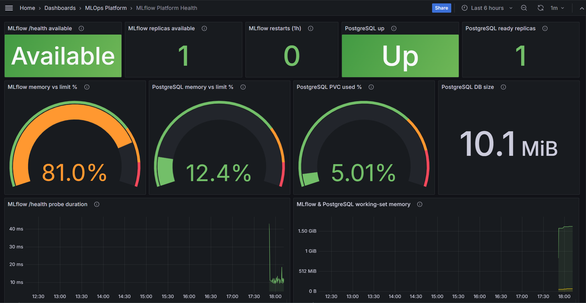
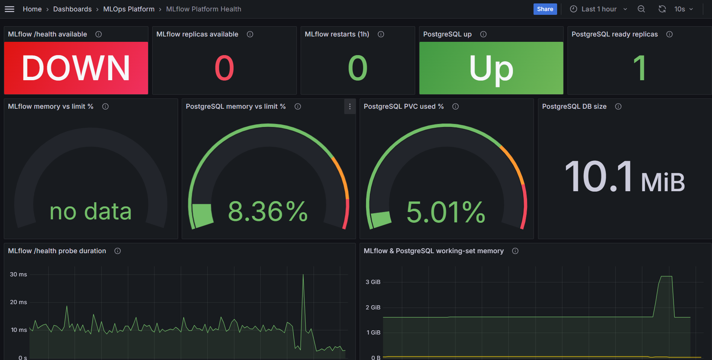
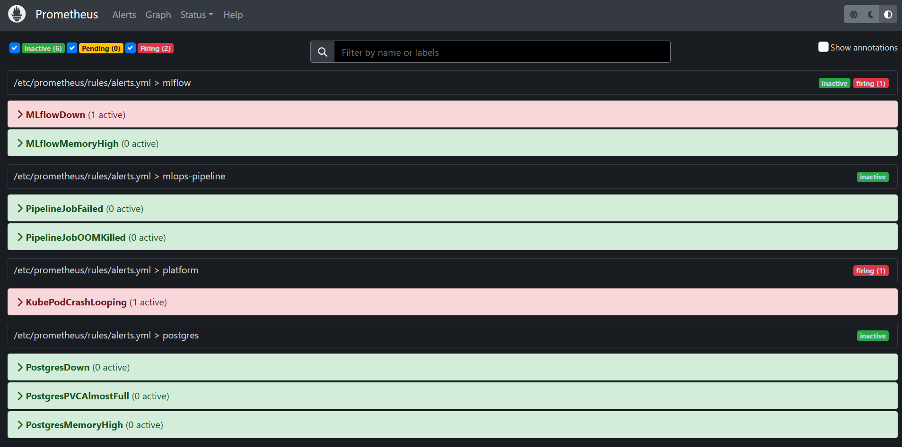
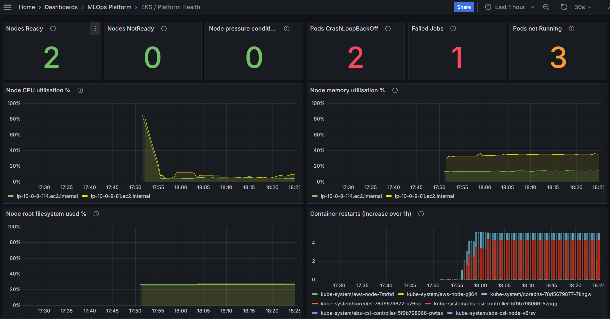
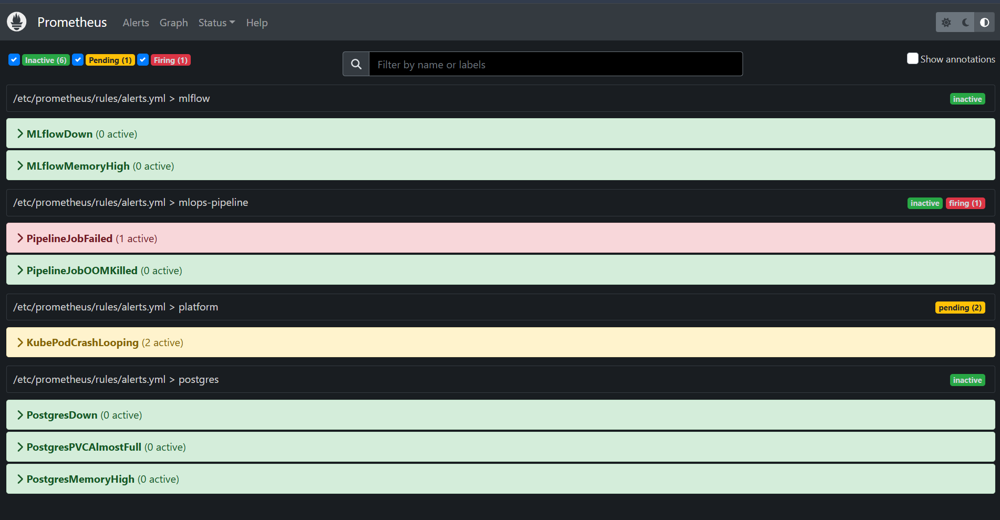

# Visual Evidence — Curated Runtime Proof

A small, curated set of **real screenshots** from the Sprint 8 live-EKS validation
sessions. Each image answers one question — *what does this prove?* — and links to
the canonical textual evidence that backs it.

> **Scope & honesty.** These are captures from **controlled, short-lived validation
> sessions** on real Amazon EKS (provision → prove → destroy the same session), not a
> 24/7 production system. Nothing here is a mock-up: every image is a live Grafana,
> MLflow, or Prometheus screen from the runs recorded in the
> [Evidence Index](README.md). The authoritative proof is the **text** in that index;
> these visuals are a fast way to *see* it. Source images live in
> [`docs/screenshots/`](../screenshots/).

The story reads top to bottom: a **healthy platform** runs a pipeline and tracks an
experiment; then failures are **injected, detected on the dashboards, and fired as
alerts** — the same verified failure/recovery loop drawn in the
[failure-recovery diagram](../diagrams/failure-recovery/README.md).

---

## 1 · Healthy baseline

### Kubernetes platform health — green baseline

- **What it proves.** The Terraform-provisioned EKS cluster is healthy under live
  observation: **2 nodes `Ready`**, and every failure counter — NotReady, node
  pressure, CrashLoopBackOff, Failed Jobs, Pods not Running — reads **0**, with node
  CPU / memory / filesystem well within limits.
- **Canonical evidence.** [Release gate §4 — Observability](sprint-08-release-gate.md)
  (Prometheus 11 targets UP) · [PR 16 live-EKS validation](sprint-08-pr16-release-validation-evidence.md)
  (EKS `v1.35.6`, 2× t3.large Ready across 2 AZs).
- **Context.** "EKS / Platform Health" is one of the three Grafana dashboards
  ([ADR-032](../decisions/ADR-032-grafana-dashboards.md)). This is the *before* state
  for the failure captures below.

### Pipeline operations — the finite Job ran and succeeded

- **What it proves.** The ML pipeline ran to completion **as a `batch/v1` Job on
  EKS** — *Last run result: **Succeeded**, 0 failed, 49 s* — with **per-stage**
  timing (fetch_dataset, preprocess, split, evaluate, train) and every stage showing
  `success = OK`. Because these metrics are pushed to the **Pushgateway**, they
  survive the Job pod's sub-minute exit and remain queryable.
- **Canonical evidence.** [PR 16 validation](sprint-08-pr16-release-validation-evidence.md)
  (pipeline Job Complete, exit 0, 5/5 stages `success=1`) ·
  [ADR-030 — pipeline operational metrics](../decisions/ADR-030-pipeline-operational-metrics.md).
- **Context.** This is the operational (Pushgateway) view of the run; the
  *experiment* results for the same run live in MLflow (next image), **not** in
  Prometheus.

### Experiment tracking — MLflow runs and a registered model

- **What it proves.** The **in-cluster MLflow** tracked real training runs for the
  `mlops-pipeline` experiment and **registered a model** ("Best Random Forest
  Classifier v1", from the `train.py` run) — experiment metadata persisted to the
  PostgreSQL backend and artifacts to SSE-KMS S3.
- **Canonical evidence.** [Sprint 7 runtime §6 — MLflow tracking](sprint-07-runtime-evidence.md) ·
  [MLflow failure tests](sprint-08-mlflow-failure-tests-evidence.md)
  (runs survive an MLflow outage; run count monotonic).
- **Context.** Run names (`brawny-gnat-594`, …) are MLflow's own random labels. This
  is the **experiment store** — the boundary the observability design is explicit
  about: experiment metrics live here, they are *not* duplicated into Prometheus.

---

## 2 · Failure detection & recovery

The failure-injection campaign drove real faults on live EKS; each was caught on a
dashboard **and** fired as a Prometheus alert. Two independent failure classes are
shown below — an **MLflow outage** and a **pipeline / Kubernetes failure** — each as a
*dashboard signal + firing alert* pair.

### MLflow outage — dashboard (Available → DOWN)

Baseline (healthy) and outage (injected) states of the same MLflow Platform Health
dashboard:

- **What it proves.** When the MLflow deployment is scaled down, the dashboard flips
  **`Available` → `DOWN`** and **replicas `1` → `0`** — while **PostgreSQL stays
  `Up`**, i.e. the outage is an *availability* fault and **experiment history is not
  lost**. This is the visual half of the MLflow-outage recovery loop.
- **Canonical evidence.** [MLflow failure tests](sprint-08-mlflow-failure-tests-evidence.md)
  (outage → `MLflowDown` FIRING → restore → RESOLVED; `pg_up=1` throughout) ·
  [runbook: mlflow-unavailable](../runbooks/mlflow-unavailable.md).
- **Context.** A before/after pair of the *same* dashboard — the fault is
  availability-only (server down, database untouched), which is exactly the
  distinction the separate MLflow and PostgreSQL panels are designed to surface.

### MLflow outage — the alert fires

- **What it proves.** The **alert half** of the same outage: `MLflowDown` transitions
  to **Firing** the moment `/health` is unreachable — closing the loop with the red
  dashboard above. The page also shows the **full 8-rule set** (mlflow ×2,
  mlops-pipeline ×2, platform ×1, postgres ×3).
- **Canonical evidence.** [MLflow failure tests](sprint-08-mlflow-failure-tests-evidence.md) ·
  [alerting.md](../alerting.md) · [ADR-033 — alerting](../decisions/ADR-033-alerting.md).
- **Context.** Alerts evaluate on Prometheus's own `/alerts` page — there is **no**
  Alertmanager routing to email/Slack/PagerDuty (deliberately deferred).

### Kubernetes / pipeline failure — dashboard and alert

- **What it proves.** A second, independent failure class. The platform dashboard
  turns the **CrashLoopBackOff / Failed Jobs / Pods-not-Running** counters **red**
  during injection — kube-state-metrics surfaces the failed **Job/Pod objects** even
  though the pipeline pod is ephemeral — and `PipelineJobFailed` **fires** on
  Prometheus. `KubePodCrashLooping` shown in **Pending** captures the alert
  `Pending → Firing` state machine (the `for:` debounce).
- **Canonical evidence.** [Dataset failure tests](sprint-08-dataset-failure-tests-evidence.md)
  (`PipelineJobFailed` fires) · [Resource failure tests](sprint-08-resource-failure-tests-evidence.md) ·
  [live-EKS evidence §6–7](sprint-08-live-eks-evidence.md).
- **Context.** The two nodes stay `Ready` throughout — the fault is at the
  workload/pod level, not the node level, which is exactly what the counters
  distinguish.

---

## Selection log

Curated **8** high-signal assets from **10** captured; every included image carries a
distinct claim. Rationale kept in the open:

| Image | Decision | Why |
|---|---|---|
| `grafana-platform-health-baseline.png` | **Selected** | K8s healthy baseline (all counters 0) |
| `grafana-platform-health-baseline-with-fail-pods-2.png` | **Selected** | K8s failure detected — clearest red counters of the three failure variants |
| `grafana-pipeline-ops-baseline.png` | **Selected** | Pipeline Succeeded + per-stage timing |
| `mlflow-runs-baseline.png` | **Selected** | Experiment tracked + model registered |
| `grafana-mlflow-health-baseline-green.png` | **Selected** | MLflow health baseline (pairs with outage) |
| `grafana-mlflow-health-outage-red.png` | **Selected** | MLflow outage detected on dashboard |
| `prometheus-mlflowdown-firing.png` | **Selected** | `MLflowDown` firing (alert half of outage) |
| `prometheus-screen.png` | **Selected** | `PipelineJobFailed` firing + Pending→Firing |
| `grafana-platform-health-baseline-2.png` | Rejected | Redundant failure-state variant (same claim as the selected red dashboard, different counts/time window) |
| `grafana-platform-health-baseline-with-fail-pods.png` | Rejected | Redundant failure-state variant (fewer red counters than the selected one) |

### Categories with no suitable visual (documented, not invented)

Some proven capabilities have **no dashboard/UI screenshot** because they are
CLI- or file-based; their evidence is textual and is not faked here:

- **Supply-chain / SBOM / image digest provenance** → text only:
  [SBOM & provenance evidence](sprint-08-sbom-provenance-evidence.md).
- **NetworkPolicy allow/deny (6 allow / 3 deny)** → text only:
  [NetworkPolicy runtime evidence](sprint-08-network-policy-runtime-evidence.md).
- **Terraform apply / EKS provisioning, `kubectl` runtime state** → text only:
  [PR 16 validation](sprint-08-pr16-release-validation-evidence.md).
- **CI (GitHub Actions) run** → text/logs only; no curated CI screenshot in the repo.

### Sanitization

Every selected image was reviewed for AWS account IDs, ARNs, credentials, tokens,
private service endpoints, user-specific paths, and email addresses — **none are
present**. Dashboard breadcrumbs, alert-rule file paths
(`/etc/prometheus/rules/alerts.yml`), the `mlops-pipeline` experiment name, and
component version strings are non-sensitive.

The only VPC-internal identifiers present are the **node internal DNS names**
(`ip-10-0-x-x.ec2.internal`) shown in two platform-health legends. These are
**non-routable RFC1918** addresses belonging to a **destroyed, short-lived
validation cluster**, are node identifiers (not reachable service endpoints or
secrets), and have been part of the public repository history since the evidence was
first committed. They are retained **unaltered** to preserve the evidentiary
integrity of the capture; redacting them would change the image without reducing any
real exposure.
